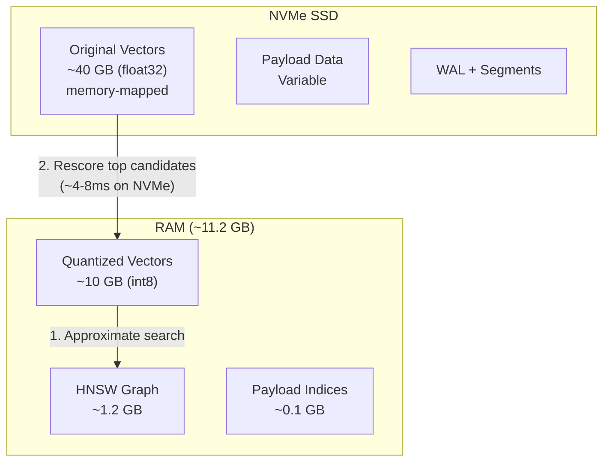
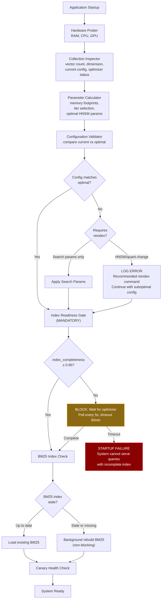
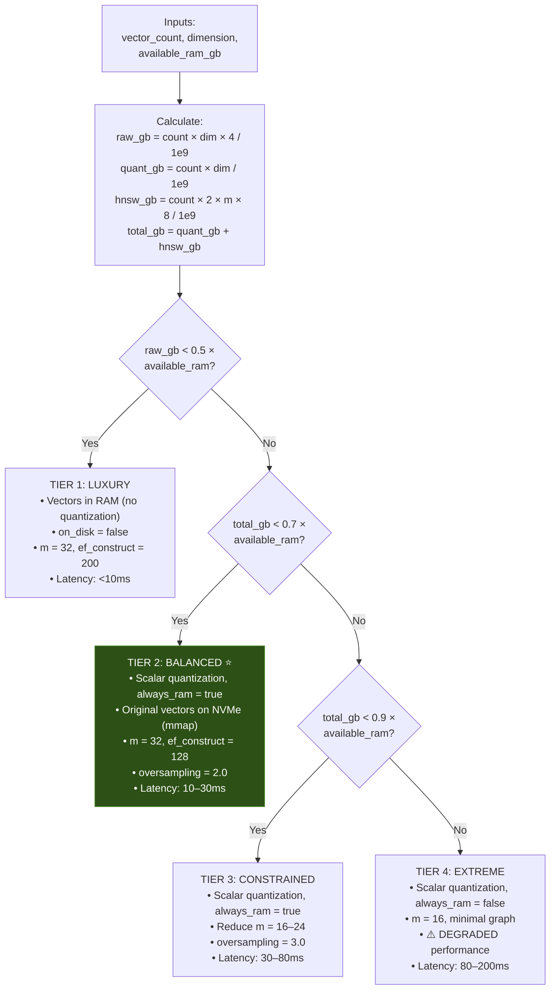
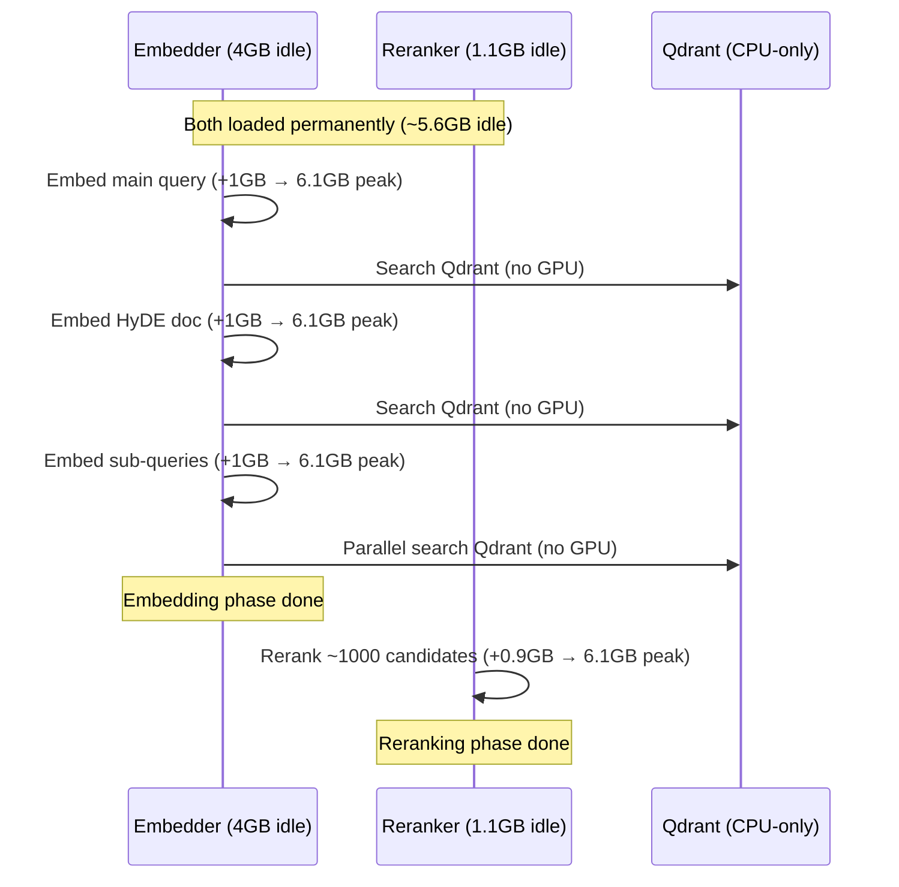
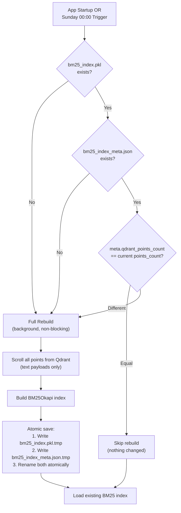

# High-Performance Auto-Tuning Qdrant Vector Search Architecture

> **Mode**: SYSTEM ARCHITECT — Planning Only (No Code)  
> **Scope**: Indexing, search, auto-tuning, memory management, growth, validation, failure modes  
> **Target**: SME Research Assistant RAG Pipeline  
> **Storage**: NVMe SSD  
> **Growth Horizon**: <5M vectors within 1 year

---

## Gap Analysis of Current System

> [!CAUTION]
> The current codebase has **zero index optimization**. The following critical gaps exist:

| Component | Current State | Risk |
|-----------|--------------|------|
| [create_collection](file:///c:/gpt/SME/src/indexing/vector_store.py#L81-L130) | Bare `VectorParams` — no HNSW config, no quantization, no `on_disk` | **Will OOM at 2.5M vectors** (~40GB raw > 43GB available RAM) |
| [search](file:///c:/gpt/SME/src/indexing/vector_store.py#L300-L389) | `query_points()` with no `search_params` | Missing `hnsw_ef`, quantization rescore/oversampling — **poor recall** |
| [docker-compose.yml](file:///c:/gpt/SME/docker-compose.yml#L19-L35) | Only `ON_DISK_PAYLOAD=true` | Missing memory limits, HNSW, storage config |
| BM25 index | Outdated `data/bm25_index.pkl` from wrong embeddings | **Must be deleted and rebuilt** from current 4096-dim Qdrant data |
| Startup | No validation of collection config, no hardware probing, no index readiness check | Silent degradation, no self-healing |
| Benchmarking | No tools exist | No way to measure recall or detect regressions |

---

## 1. INDEXING STRATEGY

### 1.1 Index Type Selection: HNSW (Mandatory)

**Brute-force is not viable.** At 2.5M vectors × 4096 dimensions, each exhaustive scan requires:
- 2.5M × 4096 × 4 bytes = ~40GB of memory reads
- ~10 billion floating-point operations per query
- Estimated latency: **500ms–2s per query** on CPU

The retrieval pipeline executes **5–8 concurrent searches per user request** (main query + HyDE + 3–5 sub-queries). Brute-force would mean **2.5–16 seconds** of total search time before reranking even begins.

**HNSW** is the only practical choice because:
- Sublinear search complexity: O(log n) vs O(n)
- Expected latency: **5–30ms per query** on NVMe SSD with quantized vectors in RAM
- Qdrant's native storage format — zero friction

### 1.2 Quantization: Scalar Quantization (SQ) — Required

The memory arithmetic is definitive:

```
Raw vectors:       2.5M × 4096 × 4 bytes (float32) = ~40 GB
Available RAM:     ~43 GB
Remaining for OS + Qdrant overhead + HNSW graph + payloads: ~3 GB ← NOT ENOUGH
```

**Scalar quantization** (float32 → int8) provides a 4× reduction:

```
Quantized vectors: 2.5M × 4096 × 1 byte (int8) = ~10 GB
HNSW graph (m=32): 2.5M × 64 links × 8 bytes = ~1.2 GB
Total RAM needed:  ~11.2 GB ← fits comfortably in 43 GB
```

**Why scalar quantization over alternatives:**

| Method | Compression | Accuracy Impact | Suitability |
|--------|------------|-----------------|-------------|
| **Scalar (int8)** | 4× | Minimal (<1% recall loss with rescoring) | ✅ **Best for 4096-dim cosine similarity** |
| Binary | 32× | Severe for high-dim cosine | ❌ Not suitable for scientific embeddings |
| Product (PQ) | 8–64× | Moderate, requires careful tuning | ⚠️ Future fallback if extreme compression needed |

Scalar quantization parameters:
- **`quantile: 0.99`** — Clips the outermost 1% of values, concentrating precision in the critical range
- **`always_ram: true`** — Keeps quantized vectors in RAM (10GB fits). Distance calculations happen in-memory
- **Rescoring with originals** — Top candidates are rescored using full-precision vectors from NVMe. On NVMe SSD, random 16KB reads complete in **~10–20μs**, making rescoring of 400 candidates take only **~4–8ms**

### 1.3 Storage Layout



- **Vectors: `on_disk: true`** — Original float32 vectors stored on NVMe with memory-mapped access. Rescoring reads ~400 × 16KB = ~6.4MB — completes in **<10ms** on NVMe
- **Payload: `on_disk_payload: true`** — Already configured. Keeps text/metadata on disk, loaded lazily
- **HNSW graph: `on_disk: false`** — Graph traversal must be in RAM for speed (~1.2GB is trivial)

### 1.4 Collection Creation Specification

The collection must be created with ALL of the following configuration (currently missing in [create_collection](file:///c:/gpt/SME/src/indexing/vector_store.py#L81-L130)):

```
vectors_config:
  size: 4096
  distance: Cosine
  on_disk: true                          # ← MISSING: enables mmap for originals
  
hnsw_config:
  m: 32                                  # ← MISSING: graph connectivity
  ef_construct: 128                      # ← MISSING: build quality
  full_scan_threshold: 20000             # When to bypass index
  max_indexing_threads: 0                # 0 = use all CPU cores
  on_disk: false                         # Keep graph in RAM

quantization_config:                     # ← ENTIRELY MISSING
  scalar:
    type: int8
    quantile: 0.99
    always_ram: true

optimizers_config:
  default_segment_number: 4              # Match CPU core groups
  max_segment_size: 200000               # Prevent oversized segments
  indexing_threshold: 20000              # Rebuild index after this many unindexed points
  memmap_threshold: 50000                # Trigger mmap after this many points
  flush_interval_sec: 5                  # WAL persistence interval

on_disk_payload: true                    # Already configured
```

### 1.5 Search Parameters Specification

Every search call (currently in [search](file:///c:/gpt/SME/src/indexing/vector_store.py#L300-L389)) must include:

```
search_params:
  hnsw_ef: 400                           # ← MISSING: 2× top_k_initial
  exact: false
  quantization:
    ignore: false                        # Use quantized vectors
    rescore: true                        # ← MISSING: rescore with originals
    oversampling: 2.0                    # ← MISSING: retrieve 2× candidates
```

**Why `hnsw_ef: 400`**: The system retrieves `top_k_initial=200` candidates. For HNSW to reliably find the true top-200, the search beam must be wider: `ef >= 2 × top_k`. At `ef=400`, expected recall@200 is ~98–99%.

**Why `oversampling: 2.0`**: By first retrieving 400 candidates from quantized vectors, then rescoring with originals (only ~8ms on NVMe) to pick the true top-200, recall loss from quantization is virtually eliminated.

### 1.6 Collection Migration Plan

> [!IMPORTANT]
> Downtime is acceptable. The migration uses a non-destructive scroll-and-upsert approach.

**Procedure:**
1. Create new collection `sme_papers_v2` with full optimal config from §1.4
2. Scroll all 2.5M points from `sme_papers` (vectors + payloads, batches of 1000)
3. Upsert into `sme_papers_v2` with `wait=True`
4. Wait for optimizer to finish building HNSW index (monitor `indexed_vectors_count`)
5. Verify: run canary queries on `v2`, compare recall against old collection
6. Swap: rename alias or update config to point to `sme_papers_v2`
7. Delete old `sme_papers` collection

**Estimated time:** 30–60 minutes for scroll+upsert, plus 15–30 minutes for HNSW index build.  
**No re-embedding required** — embeddings are unchanged, only the collection config differs.

---

## 2. CONFIGURATION VARIABLES

### Category 1: Qdrant Collection-Level Parameters

| Parameter | Controls | Accuracy Impact | Latency Impact | Auto-Calculation Logic |
|-----------|----------|-----------------|----------------|----------------------|
| `vectors.size` | Embedding dimension | N/A (fixed) | Higher dim = slower distance calc | Set from `embedding.dimension` in config |
| `vectors.distance` | Similarity metric | Must match training | Cosine slightly slower than Dot | Always `Cosine` for Qwen3 |
| `vectors.on_disk` | Vector storage location | None if rescoring enabled | NVMe: ~8ms rescore overhead | `true` when raw vectors exceed 50% available RAM |
| `hnsw_config.m` | Graph edges per node | Higher = better recall | Higher = more RAM, slower insert | See §3 auto-tuning formula |
| `hnsw_config.ef_construct` | Build-time beam width | Higher = better index quality | Only affects indexing speed | `ef_construct = m × 4` |
| `hnsw_config.full_scan_threshold` | Skip index below this count | N/A | Brute-force faster for tiny collections | Default `20000` |
| `hnsw_config.max_indexing_threads` | CPU cores for index build | N/A | More threads = faster build | `0` (auto-detect all cores) |
| `hnsw_config.on_disk` | HNSW graph storage | None | **Catastrophic if on disk** | Always `false` (in-RAM) |
| `quantization.scalar.type` | Compression level | int8 preserves 98%+ accuracy | 4× faster distance calc | Always `int8` |
| `quantization.scalar.quantile` | Outlier clipping | Lower = more clipping = slight loss | N/A | `0.99` for general use |
| `quantization.scalar.always_ram` | Quantized vector location | None | On-disk quantized = slow | `true` when quantized fits in RAM |
| `optimizers_config.default_segment_number` | Data partitioning | N/A | More segments = more parallelism | `min(cpu_cores, 8)` |
| `optimizers_config.max_segment_size` | Segment growth limit | N/A | Oversized segments block optimize | `200000` for large collections |
| `optimizers_config.indexing_threshold` | Unindexed point limit | Unindexed = brute-force searched | Degrades until indexed | `20000` |
| `optimizers_config.flush_interval_sec` | WAL persistence frequency | N/A (data safety) | More frequent = more disk writes | `5` |
| `on_disk_payload` | Payload storage | N/A | Payload reads slower from disk | `true` always |

### Category 2: Search-Time Parameters

| Parameter | Controls | Accuracy Impact | Latency Impact | Auto-Calculation Logic |
|-----------|----------|-----------------|----------------|----------------------|
| `hnsw_ef` | Search beam width | **Primary recall knob** | Higher = slower search | `max(top_k_initial × 2, m × 8, 128)` |
| `exact` | Bypass index | Perfect recall | Disastrous latency at scale | `false` always for >50K vectors |
| `quantization.ignore` | Skip quantized search | N/A | Slower without quantization | `false` when quantization configured |
| `quantization.rescore` | Rescore with originals | **Restores full accuracy** | ~8ms on NVMe | `true` always |
| `quantization.oversampling` | Candidate multiplier | Higher = better recall | More candidates to rescore | 2.0 (BALANCED tier) |
| `limit` (top_k) | Result count | N/A | Linear with top_k | From `retrieval.top_k_initial` |

### Category 3: Derived / Logical Parameters (Auto-Tuner)

| Parameter | Computed From | Purpose |
|-----------|--------------|---------|
| `raw_vector_footprint_gb` | `vector_count × dimension × 4 / 1e9` | Determines if vectors fit in RAM |
| `quantized_vector_footprint_gb` | `vector_count × dimension × 1 / 1e9` | RAM needed for quantized layer |
| `hnsw_graph_footprint_gb` | `vector_count × 2 × m × 8 / 1e9` | RAM needed for HNSW graph |
| `total_qdrant_ram_gb` | Sum of quantized + graph + overhead | Total Qdrant RAM requirement |
| `memory_tier` | `available_ram / total_qdrant_ram_gb` | Selects configuration tier (§3) |
| `optimal_m` | `f(dimension, memory_tier)` | Auto-calculated HNSW `m` |
| `optimal_ef_search` | `max(top_k × 2, m × 8, 128)` | Search beam width |
| `optimal_oversampling` | `f(memory_tier)` | Quantization rescore multiplier |
| `index_completeness` | `indexed_vectors / total_vectors` | **Must be ≥0.95 to accept queries** |
| `bm25_staleness` | `qdrant_points_count ≠ bm25_meta.points_count` | Triggers BM25 rebuild |

### Category 4: Hardware-Dependent Parameters

| Parameter | Probed Via | Impact |
|-----------|-----------|--------|
| `available_ram_gb` | `psutil.virtual_memory().available` | Primary tier selector |
| `cpu_cores` | `os.cpu_count()` | Indexing threads, segment count |
| `gpu_vram_gb` | `torch.cuda.get_device_properties()` | Embedding/reranker capacity |
| `disk_type` | Hardcoded: **NVMe SSD** | Optimistic mmap latency (~10–20μs/read) |

### Category 5: Query-Pattern Dependent Parameters

| Parameter | Source | Impact |
|-----------|--------|--------|
| `concurrent_search_count` | Pipeline: main + HyDE + sub-queries ≈ 5–8 | Total throughput requirement |
| `reranker_candidate_pool` | Sum of all search results (~1000) | Total I/O for rescoring |
| `search_timeout_ms` | SLA target (default 100ms per search) | Constrains `hnsw_ef` upper bound |

---

## 3. AUTO-TUNING STARTUP SYSTEM DESIGN

### 3.1 Architecture Overview



> [!CAUTION]
> The **Index Readiness Gate is mandatory and non-optional**. An incomplete HNSW index means queries fall back to brute-force scan on unindexed segments, causing **extreme latency** (500ms–2s+). The system must NOT accept queries until `indexed_vectors / total_vectors ≥ 0.95`.

### 3.2 Hardware Probing Module

| Probe | Method | Fallback |
|-------|--------|----------|
| Available RAM | `psutil.virtual_memory().available` | Read from config `hardware.system_ram_gb` |
| CPU Cores | `os.cpu_count()` | Default 4 |
| GPU VRAM | `torch.cuda.get_device_properties(0).total_memory` | 0 (no GPU) |
| Storage Type | Hardcoded: NVMe SSD | N/A |

### 3.3 Memory Tier Decision Logic



**Current system placement:**
```
raw_vectors_gb    = 2.5M × 4096 × 4 / 1e9 = 40.96 GB
quantized_gb      = 2.5M × 4096 × 1 / 1e9 = 10.24 GB
hnsw_graph_gb     = 2.5M × 64 × 8 / 1e9   =  1.28 GB
total_qdrant_gb   = 10.24 + 1.28            = 11.52 GB
available_ram     = 43 GB
ratio             = 11.52 / (0.7 × 43)     = 0.38 → TIER 2 (BALANCED) ✅
```

**Projection at 5M vectors (1-year horizon):**
```
quantized_gb      = 5M × 4096 / 1e9        = 20.48 GB
hnsw_graph_gb     = 5M × 64 × 8 / 1e9      =  2.56 GB
total_qdrant_gb   = 20.48 + 2.56            = 23.04 GB
ratio             = 23.04 / (0.7 × 43)     = 0.77 → Still TIER 2 ✅
```

> The system will remain in **TIER 2 (BALANCED)** for the entire 1-year growth horizon. No tier change expected unless hardware changes.

### 3.4 HNSW Parameter Auto-Calculation

```
FUNCTION compute_optimal_m(dimension, memory_tier):
    base_m = CASE dimension:
        ≤ 512:   12
        ≤ 1024:  16
        ≤ 2048:  24
        ≤ 4096:  32
        > 4096:  48
    
    tier_adjustment = CASE memory_tier:
        LUXURY:       +8
        BALANCED:      0
        CONSTRAINED:  -8
        EXTREME:     -16
    
    RETURN clamp(base_m + tier_adjustment, min=8, max=64)


FUNCTION compute_ef_search(top_k_initial, m):
    RETURN max(top_k_initial × 2, m × 8, 128)


FUNCTION compute_oversampling(memory_tier):
    RETURN CASE memory_tier:
        LUXURY:      1.0   # No quantization, no oversampling
        BALANCED:    2.0
        CONSTRAINED: 3.0
        EXTREME:     3.0
```

### 3.5 Preventing Machine-Specific Overfitting

- Auto-tuner NEVER stores machine-specific values in the config file
- All decisions are purely computed from hardware probes + dataset state at startup
- A `tuning_report.json` is written at startup with full decision trace:
  ```json
  {
    "timestamp": "2026-02-16T20:16:37",
    "hardware": {"ram_gb": 43, "cpu_cores": 20, "gpu_vram_gb": 12},
    "dataset": {"vector_count": 2500000, "dimension": 4096},
    "calculations": {"raw_gb": 40.96, "quantized_gb": 10.24, "hnsw_gb": 1.28},
    "tier": "BALANCED",
    "params": {"m": 32, "ef_construct": 128, "ef_search": 400, "oversampling": 2.0},
    "collection_config_match": true
  }
  ```
- Same codebase on a 16GB RAM machine → auto-selects TIER 3 (CONSTRAINED) — no config changes needed

---

## 4. MEMORY MANAGEMENT STRATEGY

### 4.1 Memory Budget Allocation (43GB system, TIER 2)

| Component | Allocation | Notes |
|-----------|-----------|-------|
| Qdrant quantized vectors | ~10 GB | `always_ram: true` |
| Qdrant HNSW graph | ~1.2 GB | `on_disk: false` |
| Qdrant payload indices | ~0.1 GB | DOI + section keyword indices |
| Qdrant mmap file cache (OS) | ~5–10 GB | OS page cache for original vectors on NVMe |
| Embedding model (4-bit) | ~5 GB | Qwen3-8B at 4-bit quantization |
| Cross-encoder reranker | ~1.1 GB | BGE-reranker-v2-m3 at fp16 |
| Application + Python | ~2–3 GB | Streamlit, libraries, buffers |
| OS + system services | ~3–5 GB | Windows overhead |
| **Safety margin** | **~5–10 GB** | Prevents swap |

### 4.2 GPU VRAM Budget Analysis

> [!NOTE]
> Both GPU models fit simultaneously in 12GB VRAM. Sequential inference is the optimal strategy — no model swapping needed.

| GPU Component | Idle VRAM | Peak Inference VRAM |
|--------------|-----------|---------------------|
| Qwen3-Embedding-8B (4-bit) | ~4.0 GB | ~5.0 GB (+1GB activations) |
| BGE-reranker-v2-m3 (fp16) | ~1.1 GB | ~2.0 GB (+0.9GB activations) |
| CUDA overhead / fragmentation | ~0.5 GB | ~0.5 GB |
| **Total** | **~5.6 GB** | **~6.1 GB peak** |
| **Headroom** | **6.4 GB** | **5.9 GB** |

**Pipeline VRAM flow during a query:**



**Key insight**: The embedding and reranking phases are **naturally sequential** — embeddings must complete before reranking begins. There is no VRAM contention because only one model infers at a time while the other sits idle. Both models SHOULD remain loaded permanently to avoid the ~3–5 second overhead of model loading/unloading.

**For recall accuracy and latency**, this is the optimal strategy because:
- Embedder runs at 4-bit (best available for 12GB VRAM) — full inference speed
- Reranker runs at fp16 (no quantization needed, fits easily) — full accuracy
- No time wasted swapping models
- No risk of partial model loads affecting quality

### 4.3 Graceful Degradation Strategy

When RAM pressure is detected:

| RAM Usage | Action |
|-----------|--------|
| < 70% | Normal operation |
| 70–80% | Log WARNING |
| 80–90% | Reduce `ef_search` to minimum viable, reduce `oversampling` to 1.5 |
| 90–95% | Block new indexing operations, restrict to search-only mode |
| > 95% | CRITICAL alert, minimal config, recommend restart |

### 4.4 When to Rebuild Index

| Trigger | Action |
|---------|--------|
| Memory tier changes | Rebuild with new `m` value |
| `m` or `ef_construct` needs to change | Full reindex required (HNSW cannot be updated in-place) |
| Quantization config changes | Collection must be recreated |
| Segment count grows beyond 2× optimal | Trigger optimizer with `max_segment_size` update |

---

## 5. BM25 INDEX LIFECYCLE MANAGEMENT

> [!IMPORTANT]
> The existing `data/bm25_index.pkl` is **outdated** (built from old embeddings, not from current 4096-dim Qdrant data). It must be **deleted** and rebuilt.

### 5.1 One-Time Cleanup

1. Delete `data/bm25_index.pkl`
2. Rebuild BM25 index by scrolling all chunk texts from Qdrant (no vectors needed, only `text` payload)
3. Save new index with metadata sidecar

### 5.2 BM25 Refresh Strategy



### 5.3 Smart-Skip Logic

The system tracks Qdrant state via a metadata sidecar file `data/bm25_index_meta.json`:

```json
{
  "last_build_timestamp": "2026-02-16T00:00:00Z",
  "qdrant_points_count": 2500000,
  "build_duration_seconds": 120,
  "chunk_count": 2500000,
  "index_file_size_bytes": 3500000000
}
```

**Skip conditions** (ALL must be true to skip):
1. `bm25_index.pkl` exists and loads successfully
2. `bm25_index_meta.json` exists
3. `meta.qdrant_points_count == current_qdrant_points_count`

If any condition fails → trigger rebuild.

### 5.4 Scheduled Refresh

- **Schedule**: Every Sunday at 00:00 (configurable in `config.yaml` as `bm25.refresh_schedule`)
- **Mechanism**: Background thread using `APScheduler` or `threading.Timer`
- **Behavior**: Check smart-skip conditions first. If nothing changed → skip silently with log message
- **During rebuild**: The old BM25 index remains loaded and serving queries. New index replaces it atomically on completion
- **After large batch upserts**: Also trigger a background rebuild (non-blocking)

### 5.5 Startup Behavior

1. **If `bm25_index.pkl` exists and is fresh** → Load it immediately (~5–15s for 2.5M chunks)
2. **If `bm25_index.pkl` exists but is stale** → Load the stale version (better than nothing), trigger background rebuild
3. **If `bm25_index.pkl` is missing** → System operates in semantic-only mode (BM25 weight → 0), trigger background rebuild
4. **Never block startup** for BM25 — it's supplementary (0.3 hybrid weight). Semantic search operates independently

---

## 6. DATA GROWTH HANDLING

### 6.1 Growth Projections (1-Year Horizon)

| Vector Count | Quantized (GB) | HNSW m=32 (GB) | Total RAM (GB) | Tier at 43GB RAM |
|-------------|----------------|----------------|----------------|------------------|
| **2.5M** (current) | 10 | 1.2 | 11.2 | BALANCED ✅ |
| 3.5M | 14 | 1.8 | 15.8 | BALANCED ✅ |
| **5M** (1yr max) | 20 | 2.6 | 22.6 | BALANCED ✅ |

> The system will remain in **TIER 2 (BALANCED)** throughout the 1-year planning horizon. No configuration changes needed for growth.

### 6.2 Automated Response to Growth

At each startup, the auto-tuner recalculates based on current `vector_count`:
- If tier unchanged → no action
- If tier about to change (within 20% of boundary) → log WARNING with recommendation
- Search params (`ef_search`, `oversampling`) adjust automatically without reindex

### 6.3 When to Reindex

| Condition | Detection | Action |
|-----------|-----------|--------|
| `vector_count` increased >50% since last optimization | Auto-tuner at startup | Log recommendation |
| Query latency p95 > 2× baseline | Rolling metric tracking | Trigger canary check |
| Recall@200 drops below 0.95 | Golden query benchmark | Recommend reindex |
| Hardware upgrade (more RAM) | Auto-tuner detects new tier | Opportunity for better config |

### 6.4 Detecting Performance Degradation

| Signal | Detection Method | Threshold |
|--------|-----------------|-----------|
| Query latency creep | Rolling p95 over last 100 queries | >2× baseline |
| Recall degradation | Periodic golden query benchmark | <95% recall@200 |
| Index incompleteness | `indexed_vectors / total_vectors` | **<0.95 blocks queries** |
| Segment proliferation | `segment_count` | >2× optimal |
| Optimizer stuck | `optimizer_status` | Not "ok" for >30 min |

### 6.5 Sharding (Future, >10M vectors)

> [!NOTE]
> Sharding is **not needed in the 1-year planning horizon** (<5M vectors). This section is retained for future reference only.

When a single collection exceeds what one machine can handle (>10M vectors at current hardware):
- Time-based sharding by publication year
- Domain-based sharding if metadata supports it
- Qdrant distributed mode across multiple nodes

---

## 7. VALIDATION & BENCHMARKING PLAN

### 7.1 Golden Query Set (Semi-Automatic Generation)

**Generation method:**
1. Script picks 100 random papers from the corpus
2. For each paper: extract abstract → use as query
3. That paper's DOI = guaranteed relevant result
4. Papers cited by that paper (from metadata) = additional relevant DOIs
5. Store as `data/golden_queries.json`:
   ```json
   [
     {
       "query": "Bayesian estimation of flood frequency parameters using...",
       "relevant_dois": ["10.1016/...", "10.1029/..."],
       "source_doi": "10.xxxx/...",
       "topic": "auto-detected"
     }
   ]
   ```

**Self-validation**: The source paper's own DOI MUST appear in top-200 results. If it doesn't, the index has a serious recall problem.

### 7.2 Metrics to Track Continuously

| Metric | Alert Threshold | 
|--------|-----------------|
| `recall@10` | <0.80 |
| `recall@50` | <0.90 |
| `recall@200` | <0.95 |
| `p50_latency_ms` | >30ms |
| `p95_latency_ms` | >100ms |
| `total_pipeline_latency_ms` | >2000ms |
| `qdrant_ram_usage_gb` | >80% allocation |
| `index_completeness` | **<0.95 → block queries** |
| `unique_papers_per_query` | <`min_unique_papers` |

### 7.3 Canary Monitoring at Startup

After the mandatory Index Readiness Gate passes:
1. Run 5 pre-selected canary queries from the golden set
2. Measure latency + check if expected DOIs appear in results
3. Compare against stored baseline in `data/benchmarks/baseline.json`
4. If latency >2× OR recall drops >10% → log WARNING
5. If recall drops >20% → log ERROR with reindex recommendation

**Canary execution time**: <5 seconds total

### 7.4 Benchmarking CLI Tool

| Mode | Queries | Duration | When |
|------|---------|----------|------|
| **Canary** | 5 | <10s | Every startup |
| **Standard** | Full golden set | ~2–5 min | On-demand / weekly |
| **Comparison** | Golden set × 2 configs | ~10 min | Before/after reindex |

---

## 8. FAILURE MODES TO ANTICIPATE

| # | Failure Mode | Detection | Mitigation | Severity |
|---|-------------|-----------|------------|----------|
| 1 | **Incomplete HNSW index** | `index_completeness < 0.95` | **BLOCK STARTUP** — wait for optimizer, 30min timeout, then FAIL | 🔴 Critical |
| 2 | **Excessive Disk I/O** (no quantized layer) | Correlate latency with disk I/O | Ensure `always_ram: true`; verify at startup | 🔴 Critical |
| 3 | **OOM Kill** (raw vectors in RAM) | Qdrant process disappears | Memory tier system prevents this; Docker memory limits | 🔴 Critical |
| 4 | **WAL Data Loss** after crash | `points_count` < expected at startup | `force_flush()` after upserts; Docker `stop_grace_period: 30s` | 🔴 Critical |
| 5 | **Poor recall from quantization** | Golden benchmark shows regression | Increase `oversampling`, increase `ef_search` | 🟡 Medium |
| 6 | **GPU OOM on embedding+reranking** | `torch.cuda.memory_allocated() > VRAM` | Sequential inference (natural in pipeline); both models fit at 6.1GB peak | 🟡 Medium |
| 7 | **Segment thrashing** | `optimizer_status != ok` for >30min | Batch upserts (min 100), configure `indexing_threshold` | 🟡 Medium |
| 8 | **Config drift** (collection with wrong params) | Startup validator detects delta | Auto-tuner applies optimal on new collection; log WARNING for existing | 🟡 Medium |
| 9 | **Stale BM25 index** | `qdrant_points_count ≠ bm25_meta` | Weekly Sunday rebuild with smart-skip; background startup rebuild | 🟢 Low |

> [!IMPORTANT]
> **Failure #1 is the most critical change from the current system.** The system currently has NO index readiness check. The startup flow MUST block until `indexed_vectors / total_vectors ≥ 0.95`. This is non-negotiable — an incomplete index causes brute-force fallback with extreme latency.
