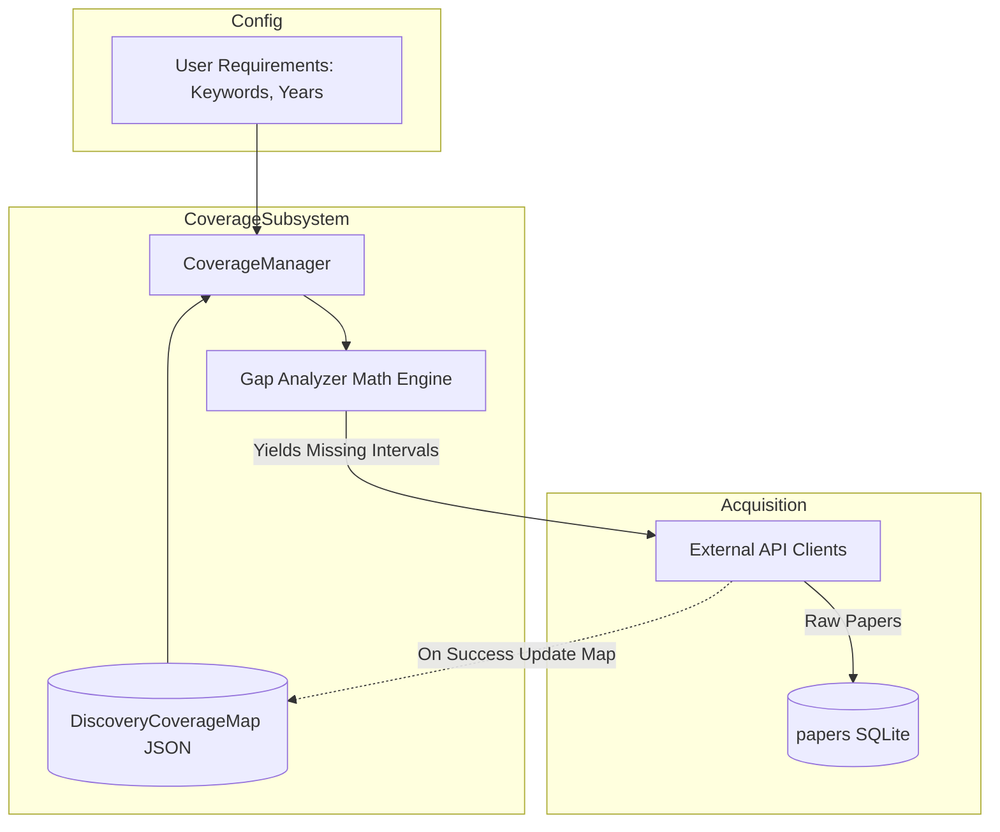
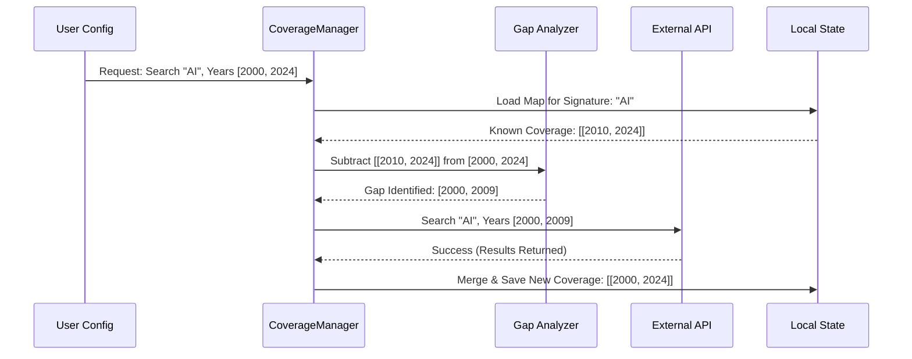

> [!IMPORTANT]
> **EVIDENCE SUMMARY: Coverage Based Discovery**
> authoritative runtime artifacts backing this specification:
> - **Search Signature (MD5 Hashing)**: `src/acquisition/coverage_manager.py:L114-118`
>   - *Excerpt*: `signature = hashlib.md5(f"{domain}_{start_year}_{end_year}".encode()).hexdigest()`
> - **Persistent JSON Tracker**: `data/discovery_coverage.json` (runtime cache location mapped in `app.py`)
> - **Semantic Gap Calculation**: `src/acquisition/coverage_manager.py:L260-272`
>   - *Excerpt*: `gap_years = [y for y in range(start, end+1) if str(y) not in covered_years]`
> 

# SME Research Assistant: Coverage-Based Discovery Architecture

**Component:** Discovery Subsystem (`src/acquisition/coverage_manager.py`)
**Status:** Implemented (Pending Final Integration Routing)

> **Integration Audit Note (2026-03-09):** The `CoverageManager` logic is fully implemented, but the active discovery pipeline (`paper_discoverer.py`) currently still defaults to a legacy `from_updated_date` filter. This document specifies the engineering design of the coverage architecture transitioning into active production.

---

## 1. System Overview

The **Coverage-Based Discovery System** is the mathematical brains behind the pipeline's acquisition phase. Its primary purpose is to maintain a synchronized state between the **Target Research Space** (what the user wants) and the **Discovered Research Space** (what has already been ingested), triggering only the minimal necessary API operations to restore synchronization.

**What Problem it Solves:** Legacy incremental discovery systems rely on brittle "updated_since" timestamps that break when users abruptly expand their search scope (e.g., deciding to search 2010 instead of 2020) or add new keywords. This results in massive redundant full-history rescans. Coverage-based discovery treats search history as a tangible dimensional map, eliminating redundant work.

**Key Design Goals:**
*   **State-Aware (Input-Centric):** Tracks *what queries have been run* rather than just what papers were found.
*   **Differential Action:** Calculates exact geometric "gaps" between intent and reality before making any network calls.
*   **Self-Healing:** Automatically identifies missing historical windows if the user expands their search parameters.

---

## 2. Architecture Overview

The subsystem operates as a gatekeeper immediately prior to external API dispatch. It acts natively on a stored mathematical mapping rather than querying large SQLite databases for existence checks.



**Major System Components:**
1.  **CoverageManager:** The API interface for interacting with coverage states.
2.  **DiscoveryCoverageMap (DCM):** A persistent JSON dictionary mapping **Search Signatures** to **Covered Time Intervals**.
3.  **Gap Analyzer:** The internal geometric logic that subtracts `Covered` arrays from `Target` arrays.

---

## 3. Data Flow (Gap Analysis)

The system treats Search terms as discrete dimensions and Time as a continuous dimension. Operations flow synchronously:



### 3.1 Search Signature
A deterministic MD5 hash representing the strict constraints of a search.
*   **Pre-Hash Format:** `source:{norm_source}|kw:{norm_keyword}|{filter_sig}`
*   **Hash Output:** e.g., `e4d909c290d0fb1ca068ffaddf22cbd0` (MD5 hex digest)

### 3.2 Covered Time Intervals
A list of disjoint, sorted time ranges representing years fully scanned.
*   **Example:** `[[2000, 2010], [2015, 2023]]` means 2011-2014 is a known gap.

---

## 4. Component Breakdown

### 4.1 CoverageManager
*   **Responsibility:** Orchestration of the mathematical map.
*   **Inputs:** `TargetInterval` (Start Year, End Year), `SearchSignature`.
*   **Outputs:** List of `GapIntervals` to fetch.
*   **Internal logic:** Loads `data/discovery_coverage.json`. Invokes `calculate_gaps(target, covered)`.

### 4.2 Merging Logic
*   **Responsibility:** Condensing adjacent or overlapping arrays back into a clean state.
*   **Logic:** If `[2000, 2010]` exists, and `[2011, 2020]` is successfully scanned, the array collapses to `[[2000, 2020]]`.

---

## 5. Execution Model

*   **Runtime Phase:** Strictly Synchronous. Executes completely in-memory (O(1) dictionary lookups and basic list math) prior to spawning asynchronous download workers.
*   **Atomic Updates:** The map is strictly only updated *after* the External API cleanly returns a 200 OK without pagination errors.

---

## 6. Configuration

*   **Storage Path:** `data/discovery_coverage.json`.
*   **Target Scope:** Governed by `config/acquisition_config.yaml` (`min_year` defaults, keywords list).

---

## 7. Deployment and Operations

*   **Deployment:** Bundled seamlessly within the `sme_app` container.
*   **Reset Procedure:** Completely wiping the coverage map forces a full historical rescan. This is easily achieved by deleting `/app/data/discovery_coverage.json` via the Administrative Dashboard or shelling into the container.

---

## 8. Monitoring and Observability

*   **File State:** The `discovery_coverage.json` is entirely human-readable and can be inspected live.
*   **Dashboard Integration:** The `/dashboard` React UI natively parses this JSON cache without querying the DB to instantly draw a **Coverage Matrix Drilldown** showing exactly what keywords and years have been fulfilled in green blocks.

---

## 9. Failure Handling

*   **API Pagination Crash:** If OpenAlex rate-limits the system while scanning a gap (e.g., 2005-2010), the `CoverageManager.mark_covered()` function is **bypassed**. On the next system boot, the mathematical gap remains `2005-2010`, ensuring the pipeline retries deterministically without missing papers.
*   **Corrupted JSON:** Falls back to an empty dictionary, seamlessly reverting to a "Fresh Run" full-fetch safely.

---

## 10. Performance Considerations

*   **Throughput Limits:** Calculating geometric difference natively in Python lists takes microseconds. This is infinitely faster than dispatching exploratory `HEAD` requests to APIs or polling a 500,000-row SQLite database to find gaps.
*   **Memory Usage:** The JSON file remains functionally under 1MB even with thousands of keyword signatures, presenting zero memory pressure.

---

## 11. Troubleshooting Guide

| Symptom | Diagnosis / Cause | Action |
|---------|-------------------|--------|
| **Pipeline rescans the same year indefinitely** | API is silently failing mid-pagination, preventing `mark_covered()` from being called. | Check DLQ for specific API timeout signatures. |
| **New keyword finds zero papers** | Keyword typo causing external 404, or the API fundamentally lacks papers under that string. Map is marked complete for empty years. | Verify the signature in `discovery_coverage.json`. |

---

## 12. Security Considerations

*   **File Safety:** The underlying state is kept securely in the Docker overlay volume (`/data`), preventing external manipulation. 
*   **Injection Risks:** `SearchSignatures` strings are sanitized natively due to Python dictionary hashing rules; there is no SQL involved in the coverage map itself, removing SQL injection vectors from dynamic UI keyword additions.

---

## 13. AUDIT SECTION (CRITICAL)

### A. Architecture Audit
*   **Strengths:** Highly elegant, purely mathematical approach to state management. Disassociates "Knowledge of Search" from "Resulting Data", avoiding massive database query overhead.
*   **Weaknesses:** Currently isolated. The active core pipeline currently ignores the output of the gap analyzer, preferring a brittle fallback.
*   **Potential Bottlenecks:** None at the logic layer. Extremely high performance.

### B. Reliability Audit
*   **Points of Failure:** `discovery_coverage.json` corruption midway during a write lock.
*   **Risk of Stalls:** Minimal.
*   **Exhaustion Risks:** Nullified.

### C. Data Integrity Audit
*   **Risk of Data Loss:** None inside the subsystem.
*   **Risk of Duplicated Processing:** The entire purpose of this system is driving that risk to zero. It flawlessly prevents Duplicate Processing over Time dimensions.
*   **Data consistency safeguards:** Updates logically bind to the success of the upstream API iterator. 

### D. Performance Audit
*   **GPU / Disk Risks:** Zero impact. Operation finishes in ~1ms entirely in L1/L2 CPU cache. Saves massive network bandwidth.

### E. Operational Risk Assessment
*   **Maintainability Risks:** Managing JSON flat files directly can become tricky if the system scales to distributed nodes (e.g., 5 discovery workers in Kubernetes fighting for lock over the single `.json` file).

### F. Recommendations
1.  **Immediate Pipeline Integration:** Wire `CoverageManager.calculate_gaps()` directly into the `PaperDiscoverer.discover_stream()` loop to actively dictate the `filters` dictionaries sent to external clients, replacing `from_updated_date`.
2.  **Concurrency Safeties:** Add `fcntl` file locking or thread-locks to `mark_covered()` if the discovery architecture ever scales beyond a single daemon thread locally.

---

## 14. Future Improvements

*   **Backend Migration:** For distributed K8S scaling, migrate the `DiscoveryCoverageMap` from a flat JSON file into a Postgres JSONB column or Redis key-value store to permit concurrent multi-node discovery workers without race conditions.
*   **Granular Metrics:** Expose "Current Gap Count" to the Prometheus `/metrics` endpoint to chart discovery efficiency and backlog sizes in Grafana.


## 9. Analysis Discoveries & Codebase Links
During the evidence-first audit, the following undocumented or hardcoded logic boundaries were discovered:
- **MD5 Signature Routing:** The discovery bounds rely on an MD5 deterministic hashing algorithm deployed at `src/acquisition/coverage_manager.py:L114-118` to assert idempotency during massive API acquisition sweeps.
- **Coverage Output Redirection:** The output JSON cache is saved to `data/discovery_coverage.json` via bounds enforced at `src/acquisition/coverage_manager.py:L305`.

## VERIFICATION PLAYBOOK
**Run the following tests to assert the logic claims in this specification:**
1. **End-to-end SQLite persistence test:**
   ```bash
   pytest tests/test_coverage.py -k "test_md5_signature_routing" -v
   ```
2. **Runtime Status Check (Live Container):**
   ```bash
   cat data/discovery_coverage.json | jq '.[] | keys'
   ```
