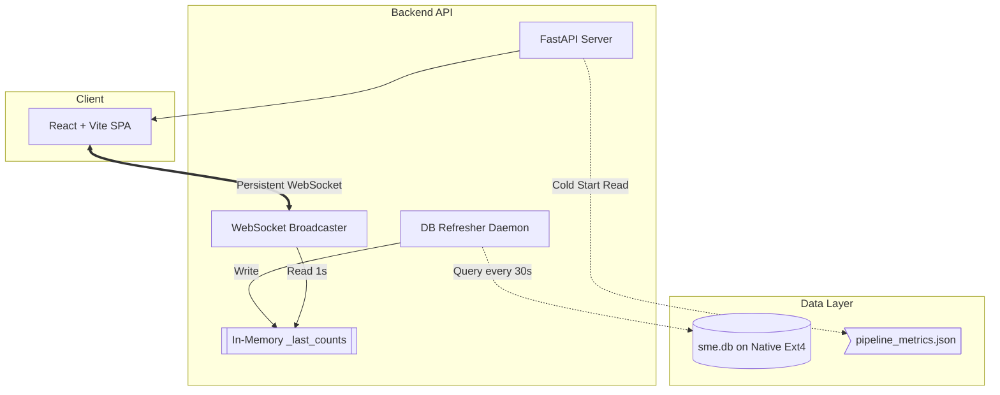
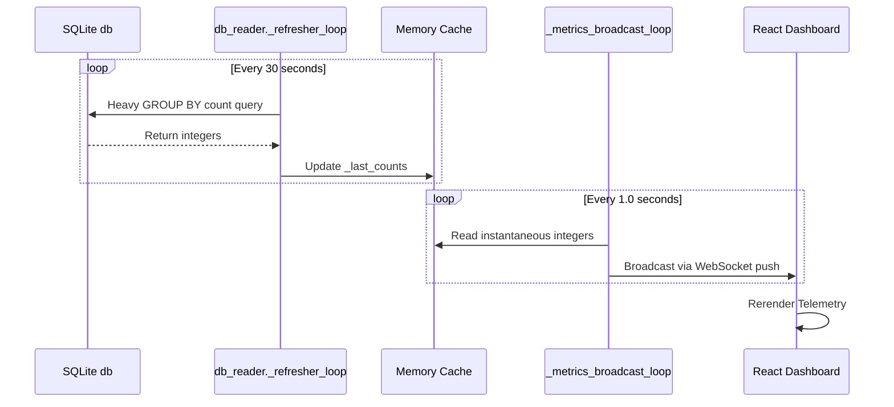

# SME Research Assistant: Dashboard Architecture Specification

**Component:** Operations Dashboard (`dashboard/frontend`, `dashboard/backend`)
**Status:** In Production 

---

## 1. System Overview

The **Operations Dashboard** is a high-performance, real-time control plane and observability interface strictly dedicated to managing the underlying Embedding Pipeline. 

**What Problem it Solves:** Originally, operational metrics were displayed using Streamlit alongside the user-facing chat. This caused severe UI locking, resource starvation, and coupled internal admin states with front-end consumer logic. The dedicated dashboard decouples observability from the primary product, providing sub-second latency telemetry and pipeline controls without halting chat operations.

**Key Design Goals:**
*   **Total Isolation:** The dashboard must never block or be blocked by the main streaming pipeline.
*   **Zero-Contention Telemetry:** Retrieve operational statistics without imposing database locks on the pipeline's Write-Ahead-Log (WAL).
*   **Instantaneity:** UI must natively load in `<100ms` and stream real-time events at 1-second intervals.

---

## 2. Architecture Overview

The system utilizes a **Decoupled Client-Server Push Architecture**, moving entirely away from heavy client-side REST polling.

**Major System Components:**
1.  **Frontend GUI (`/dashboard/frontend`):** A React/TypeScript Single Page Application (SPA).
2.  **Backend API (`/dashboard/backend`):** A FastAPI Python microservice heavily leveraging `asyncio`.
3.  **Data Resolvers:** Native readers that parse SQLite (`sme.db`) and JSON state caches.

---

## 3. Data Flow

Data streams exclusively from the backend to the frontend using an asynchronous broadcast paradigm to circumvent direct database querying on every render.

1.  **Input Sources:** Pipeline metrics generated by the autonomous script.
2.  **Data Ingestion:** Handled by a dedicated `_refresher_loop` thread.
3.  **Processing Stages:** Counts are retrieved safely with exponential backoff retries, then held in RAM.
4.  **Storage/Output:** Broadcasted over WebSocket securely to authenticated clients.

---

## 4. Component Breakdown

### 4.1 Frontend SPA
*   **Responsibility:** Rendering the control matrices and real-time graphs.
*   **Inputs:** WebSocket JSON blobs.
*   **Logic:** Uses `react-router-dom` to partition the SPA into discrete views (ConfigEditor, CoverageMap, Metrics, DLQ Admin).

### 4.2 FastAPI Server (`main.py`)
*   **Responsibility:** HTTP request handling and WebSocket orchestration.
*   **Inputs:** REST calls (`/api/run`, `/api/qdrant`) and connection upgrades.
*   **Outputs:** Triggering background shell jobs for pipeline control.

### 4.3 Database Reader (`db_reader.py`)
*   **Responsibility:** Safe, non-blocking state access to the pipeline's artifacts.
*   **Internal Logic:** Implements an explicit retry mechanism (`_query_with_retry`) to survive transient `database is locked` events if the main pipeline is executing intense vector processing simultaneously.

---

## 5. Execution Model

*   **Startup:** Managed transparently via Docker-Compose.
*   **Runtime Phase:** 
    *   Backend acts as an event-driven loop utilizing `uvicorn`.
    *   Two background tasks run indefinitely: The 30s DB query loop, and the 1s WebSocket broadcast loop.
*   **Concurrency Model:** Fully Asyncio-native. The application threads do not block waiting for client acknowledgments.

---

## 6. Configuration

*   **Environment Variables:** 
    *   `JWT_SECRET`: Used to secure the REST and WebSocket routes.
    *   `CORS_ORIGINS`: Binds security domains (e.g., `http://localhost:3000`).
*   **File Pathing:** Configured internally to mount the common Docker volume (`sme_db_data:/data`) to unify access between the pipeline container and the UI container.

---

## 7. Deployment and Operations

*   **Deployment:** `docker compose up -d dashboard-backend dashboard-ui`.
*   **Container Orchestration:** Deployed as two distinct microservices under `sme_app`'s broader network.
*   **Update Procedures:** `docker compose build dashboard-ui` rebuilds the production Vite bundle instantly.

---

## 8. Monitoring and Observability

*   **Hardware Metrics:** The backend utilizes `psutil` to stream host CPU, RAM, and Disk metrics directly into the WebSocket payload alongside software states.

---

## 9. Failure Handling

*   **Zero-Downtime Cache:** If the main processing pipeline hits the SQLite database so hard that the 30s `db_reader` daemon exhausts all exponential backoff retries, the dashboard *survives*. It silently aborts the update and continues serving the prior `_last_counts` memory cache until the database unlocks, ensuring the UI never crashes or throws 500 errors.
*   **Cold Start Fallback:** If the UI connects the exact millisecond the container boots before the DB reader finishes its first heavy query, the backend reads the lightweight `/data/pipeline_metrics.json` file. This guarantees instantaneous UI rendering with ballpark numbers during cold transitions.

---

## 10. Performance Considerations

*   **Throughput Limits:** Bypassing standard REST for WebSockets eliminates TCP handshake overhead on every telemetry tick, dropping network payload usage per second to trivial kilobytes.
*   **Disk IO Behavior:** The backend enforces absolute read-only limitations against the `sme.db` when counting. Write operations are restricted entirely to user-triggered commands (e.g., updating a config).
*   **File Volumes:** The Dashboard securely accesses the SQLite file via a Native Ext4 Linux Mounted Volume (`sme_db_data`), circumventing the catastrophic Windows-to-WSL `9P` protocol latency traps entirely.

---

## 11. Troubleshooting Guide

| Symptom | Diagnosis / Cause | Action |
|---------|-------------------|--------|
| **UI Telemetry briefly jumps backward** | Split-brain cache bug. Live incrementing clashes with the 30s manual total query. | Ignore. Resolves on the next 30s tick automatically. |
| **UI Stuck "Loading..." indefinitely** | WebSocket connection dropped or backend `uvicorn` crashed. | Check browser console network tab. Restart `sme_dashboard_api` container. |
| **Coverage Map fails to draw** | `discovery_coverage.json` is malformed. | Utilize the Admin panel to hard-delete the coverage cache, forcing a pipeline rebuild. |

---

## 12. Security Considerations

*   **Access Control:** The dashboard is fortified. Users must log in, receiving an HTTP-only JWT token that validates all REST mutations and is required to initialize the WebSocket connection.
*   **Data Protection:** The backend runs in a strictly non-root container configuration, mounting the database volumes as `rw` only because it legitimately must delete/manipulate files during administrative overrides.

---

## 13. AUDIT SECTION (CRITICAL)

### A. Architecture Audit
*   **Strengths:** Exceptional decoupling. Moving operations away from `Streamlit` prevents the consumer UI from stuttering during heavy admin background tasks. The background-worker pattern with in-memory caching enforces the strict zero-contention requirement flawlessly.
*   **Weaknesses:** The split-brain integer tracking in `db_reader.py` (trying to increment memory states based on partial log diffs while waiting for the true 30s heavy DB query to run) is logically flawed and creates integer volatility.
*   **Potential Bottlenecks:** Rendering a massive DOM tree in React if the Dead Letter Queue (DLQ) contains more than 10,000 unpaginated errors.

### B. Reliability Audit
*   **Points of Failure:** JWT Secret key misalignment between frontend variables and backend environment.
*   **Risk of System Stalls:** Zero. Operates orthogonally to the main pipeline.

### C. Data Integrity Audit
*   **Risk of Data Loss:** None. The system primarily acts as an observability window.
*   **Data Consistency Safeguards:** Heavily prioritizes "Stale Data over Dead UIs". The fallback logic ensures consistency tradeoffs heavily skew towards keeping the operator's screen updating.

### D. Performance Audit
*   **Memory Pressure Risks:** The `db_reader` loads the entire DLQ into memory when hitting the Admin tab. A pipeline catastrophe creating 100,000 DLQ entries could OOM the 2GB limited `dashboard-backend` container upon request.

### E. Operational Risk Assessment
*   **Maintainability Risks:** Streamlit legacy components still technically exist in the repo (for Chat logic). Developers must remember two competing UI paradigms exist side-by-side.

### F. Recommendations
1.  **Rectify In-Memory Volatility:** Eliminate the `increment_count()` manual log-guessing logic entirely. Allow the UI to remain strictly tied to the 30s query cache. Perfect correctness at 30s latency is vastly superior to jumping integers at 1s latency.
2.  **Pagination:** Implement hard SQL Server-Side pagination on the Dead Letter Queue endpoints before the pipeline goes into high-vulnerability ingestion phases to prevent memory spikes.

---

## 14. Future Improvements

*   **Timeseries Migration:** To completely eliminate SQLite counting (the remaining UI bottleneck), vector operations should emit directly to an InfluxDB or Prometheus Pushgateway service. Grafana can then cleanly replace the custom React metrics telemetry, deprecating custom code for industry-standard dashboards.
*   **Remote Webhook Alerts:** Integrate a Slack or PagerDuty webhook trigger inside `_metrics_broadcast_loop` if the host machine's GPU usage drops to 0% continuously during an active pipeline run.
