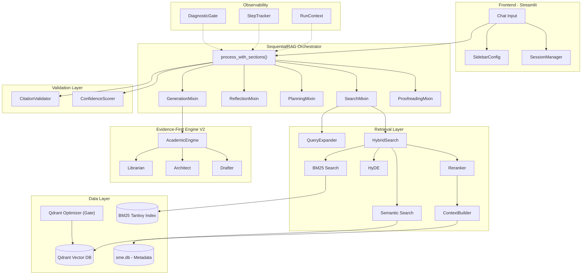
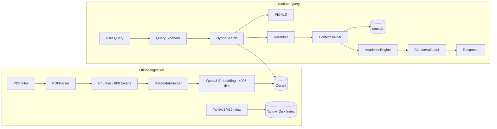
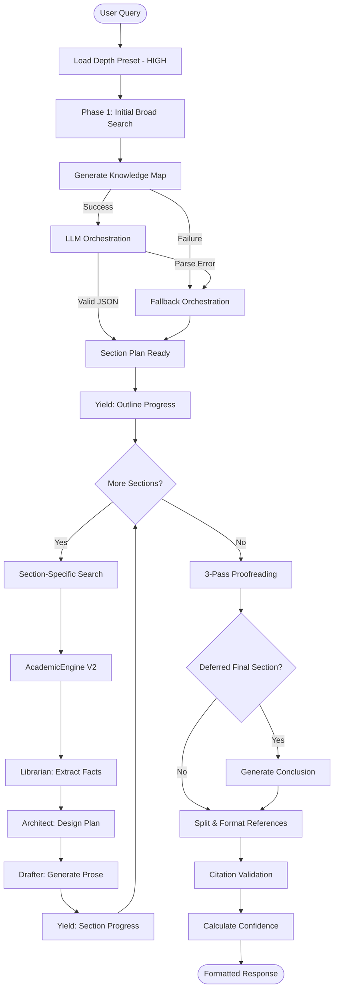
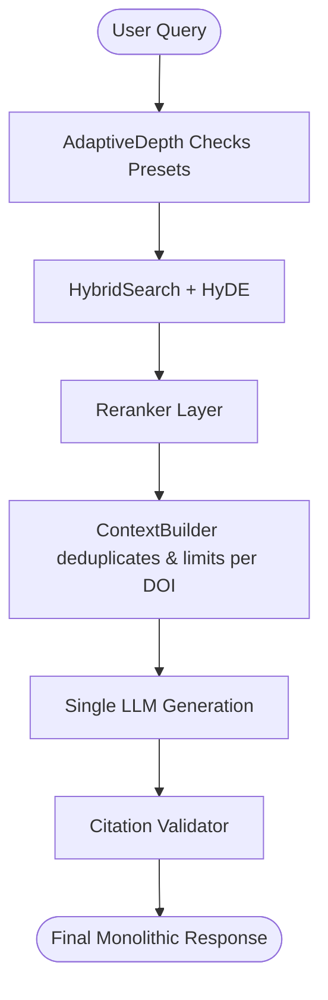
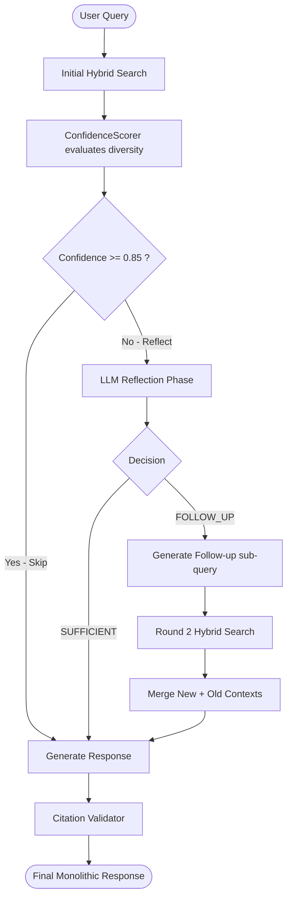
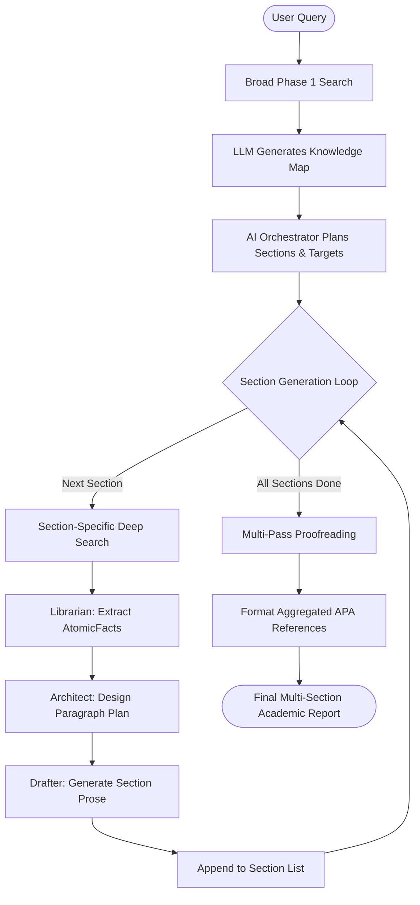
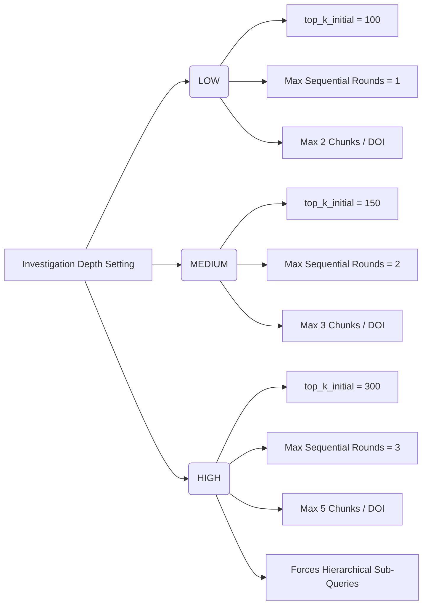
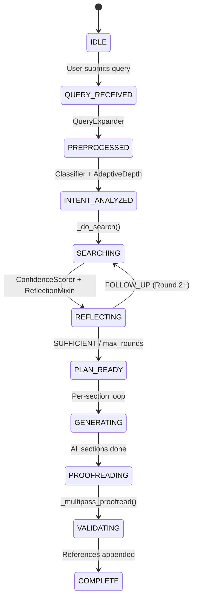
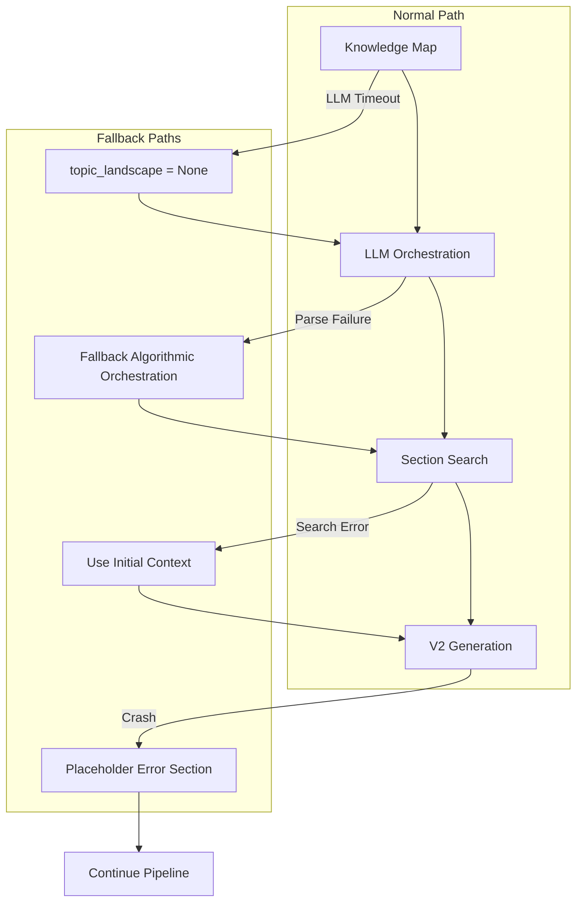

> [!IMPORTANT]
> **EVIDENCE SUMMARY: RAG Workflow & Orchestration**
> authoritative runtime artifacts backing this specification:
> - **System Wide Depth Bounds**: `src/config/depth_presets.py:L14-38`
>   - *Excerpt*: `"High": {"min_unique_papers": 25, "max_per_doi": 5, "max_tokens": 12000}`
> - **Let AI Decide Logic Branch**: `src/config/depth_presets.py:L95-103`
>   - *Excerpt*: `if let_ai_decide: target = preset["min_unique_papers"]` (Note: hardcoded to True in `sequential_rag.py`)
> - **Process With Sections Generator Mapping**: `src/retrieval/sequential_rag.py:L346-384`
> - **Confidence Scorer Math Weights**: `src/retrieval/confidence_scorer.py:L79-84`
>   - *Excerpt*: `"relevance_coverage": 0.35, "doi_diversity": 0.30`
> 

# SME Research Assistant — Production-Grade RAG Pipeline System Documentation

> **Document Type:** System Architecture & Operational Specification
> **System:** SME Research Assistant (Retrieval-Augmented Generation Pipeline)
> **Classification:** Internal Engineering Documentation

---

## Table of Contents

1. [System Overview](#1-system-overview)
2. [RAG Architecture](#2-rag-architecture)
3. [Workflow Overview](#3-workflow-overview)
4. [Retrieval Process](#4-retrieval-process)
5. [Reasoning & Investigation Workflow](#5-reasoning--investigation-workflow)
6. [Configuration Modes](#6-configuration-modes)
7. [Detailed Scenario (Existing Configuration)](#7-detailed-scenario-existing-configuration)
8. [Pipeline Execution Logic](#8-pipeline-execution-logic)
9. [Component Responsibilities](#9-component-responsibilities)
10. [Data Flow and State Management](#10-data-flow-and-state-management)
11. [Performance Considerations](#11-performance-considerations)
12. [Observability and Logging](#12-observability-and-logging)
13. [Failure Modes and Edge Cases](#13-failure-modes-and-edge-cases)
14. [Audit and System Validation](#14-audit-and-system-validation)
15. [Recommended Improvements](#15-recommended-improvements)

---

## 1. System Overview

### 1.1 Purpose of the RAG Pipeline
The primary purpose of the RAG pipeline is to bridge the gap between deterministic data storage (Qdrant vectors and SQLite metadata) and non-deterministic natural language generation. It achieves this by pulling highly relevant academic context into the LLM's working memory specifically at inference time.

The SME Research Assistant synthesizes scholarly responses from a curated knowledge base of academic papers in Transportation Engineering. It converts user queries into multi-section, APA-cited academic responses grounded exclusively in indexed literature.

### 1.2 Core Objectives
- **Fidelity:** Eradicate hallucinations by enforcing an Evidence-First drafting process.
- **Traceability:** Maintain mathematical and programmatic links from generated sentences back to exact PDF chunks via APA standards.
- **Resilience:** Gracefully degrade during LLM timeout or vector database latency without destroying the user experience.

### 1.3 High-level System Behavior
The system takes natural language questions, mathematically assesses their complexity, determines a retrieval depth strategy, performs multi-modal search (Semantic + Keyword), reasons over the retrieved context to see if it is sufficient, and finally coordinates a multi-agent generation cascade (Librarian -> Architect -> Drafter) to produce academic prose.

### 1.4 Architectural Philosophy (Original)
**Evidence-First Architecture** — The system follows a "Graph of Claims" model where raw retrieval results are decomposed into structured `AtomicFact` objects before any prose is generated. This replaces the legacy "Prompt-and-Pray" pattern where the LLM was given raw context and trusted to cite correctly.

The pipeline is: **Retrieve → Extract Facts → Plan Structure → Draft Prose**.

### 1.5 Assumptions and Constraints
| Assumption | Impact |
|------------|--------|
| Knowledge base is pre-indexed in Qdrant | No runtime ingestion — stale data risk |
| Single LLM backend (Ollama) | No failover to alternate LLM providers |
| BM25 index is Tantivy disk-backed (auto-syncs with Qdrant) | `data/bm25_index_tantivy/` directory, 5% drift threshold |
| GPU required for embeddings | Startup GPU gate raises `RuntimeError` if CUDA unavailable — no silent CPU fallback *(H8 fix)* |
| Max context budget ~240K chars (High) | `AdaptiveTokenManager` dynamically allocates per-section budgets |

---

## 2. RAG Architecture

### 2.1 Components of the Pipeline
The architecture relies heavily on mixin composition to prevent massive, monolithic class files, instead spreading logic across operational domains.

### 2.2 Core Design Principles
| Principle | Implementation |
|-----------|---------------|
| **Mixin Composition** | `SequentialRAG` inherits from 5 mixins: `SearchMixin`, `ReflectionMixin`, `PlanningMixin`, `GenerationMixin`, `ProofreadingMixin` |
| **Factory Pattern** | All components created via `create_*` factory functions (e.g., `create_hybrid_search()`, `create_context_builder()`) |
| **Depth Presets** | Three tiers (Low/Medium/High) control all hyperparameters from a single source of truth in `depth_presets.py` |
| **Streaming Architecture** | Yields `GenerationProgress` objects for real-time UI updates |
| **Defensive Diagnostics** | `DiagnosticGate` context managers wrap all fallible operations with severity levels and suppression |
| **Citation Compliance** | Post-generation validation via `CitationValidator` with regeneration loop |

### 2.3 Interaction Between Components


### 2.4 Data Flow Diagram


---

## 3. Workflow Overview

### 3.1 End-to-End Execution Flow
The RAG pipeline operates deterministically from initialization all the way to response output. 



### 3.2 System Initialization & Index Gate (Step 0)
**Inputs:** Hardware profile, Qdrant collection configuration
**Outputs:** Optimal DB parameters, Readiness boolean
**Internal Logic:**
1. `run_startup_optimization()` executes before any queries are accepted.
2. Probes RAM, CPU cores, and GPU VRAM to determine memory Tier.
3. Adapts HNSW parameters based on Tier.
4. Validates Qdrant collection configuration.
5. **MANDATORY GATE:** Polls DB until indexed vectors count >= 95%. Blocks system to prevent severe latency.

### 3.3 User Query Received (Step 1)
**Inputs:** Raw query string from chat input, `SidebarConfig`
**Outputs:** Validated query string, resolved configuration parameters
**Decision Rules:**
- If `enable_section_mode=True`: route to `process_with_sections()`
- If `enable_sequential=True` AND NOT `enable_section_mode`: route to `process_with_reflection()`
- Else: route to standard `process_query()`

### 3.4 Preprocessing (Step 2)
**Inputs:** Raw query string
**Outputs:** Expanded queries list, complexity assessment
**Internal Logic:**
- Classifies query complexity.
- Uses rule-based or LLM-based query decomposition.
- Domain-specific synonym expansion.

### 3.5 Intent Analysis (Step 3)
**Inputs:** Preprocessed query
**Outputs:** `query_type`, `complexity`, `AdaptiveParams`
**Internal Logic:**
- Classifies query into: "definition", "comparison", "mechanism", "review", "general".
- Feeds into `AdaptiveDepth` algorithm.

---

## 4. Retrieval Process

### 4.1 Embedding Generation and Vector Search
(From original Step 6: Embedding / Vector Search Flow)
**Inputs:** Query (or sub-queries), search parameters
**Outputs:** Raw retrieval results list
**Internal Logic:**
1. `QueryExpander.decompose_query()` creates sub-queries
2. For each sub-query:
   a. **Semantic path:** Embeds 4096-dim vector, searches Qdrant using HNSW.
   b. **BM25 path:** Keyword index search on Tantivy.
3. **HyDE:** LLM generates hypothetical answer -> embeds -> searches.
4. `HybridSearch.search()` applies Reciprocal Rank Fusion (0.7 Semantic + 0.3 BM25).
5. Results from HyDE are extended, never overwritten.

### 4.2 Ranking / Filtering
(From original Step 7)
**Inputs:** Raw hybrid search results
**Outputs:** Ranked, deduplicated, diversity-enforced results
**Internal Logic:**
1. `Reranker.rerank()` via cross-encoder.
2. `ContextBuilder._deduplicate()` removes >80% Jaccard similarity chunks.
3. `ContextBuilder._limit_per_doi()` enforces source diversity.

### 4.3 Context Assembly
(From original Step 8: Context Assembly)
**Inputs:** Ranked results, APA resolver
**Outputs:** Context string, APA references list, DOI→number mapping
**Internal Logic:**
- Budget sized independently via `AdaptiveTokenManager`.
- Formats chunks with numbered citations.
- Priority: Qdrant payload -> sme.db lookup -> bare DOI fallback.

---

## 5. Reasoning & Investigation Workflow

### 5.1 Sequential Thinking Mode Overview
(From original Step 9: Reasoning Pipeline)
**Inputs:** Initial context, query, model
**Outputs:** Decision (SUFFICIENT/FOLLOW_UP), optional follow-up query
**Internal Logic:**
1. Calculates multi-variate confidence.
2. Confidence routing (skip reflection if high, expand if medium, full chain-of-thought if low).
3. If `< 12` papers are found, logic forces a follow-up.

### 5.2 Section Mode Operation
(From original Step 4: Investigation Planning)
**Inputs:** Query, depth, initial results, topic landscape
**Outputs:** Orchestrated section plan JSON
**Internal Logic:**
1. Analyzes top 150 results to build "Knowledge Map".
2. Single orchestrator LLM maps sections to citations.
3. Validates orchestration dynamically.

### 5.3 Evidence-First Cascade
(From original Step 10: Response Generation)
**Inputs:** Section plan, per-section context
**Outputs:** Generated section prose
For each section:
1. **Librarian phase:** `extract_facts_from_chunks()` -> extracts `AtomicFact`. Dynamic batch sizing (3-10).
2. **Architect phase:** `design_section_plan()` -> LLM creates `ParagraphPlan[]`. Scales paragraph/fact counts dynamically.
3. **Drafter phase:** `draft_section()` -> Resolves exact evidence IDs. Drafts prose strictly using provided evidence.

```mermaid
flowchart LR
    subgraph Step1["Step 1: Librarian"]
        A["Retrieval Results"] --> B["Batch Chunks"]
        B --> C["LLM Extract"]
        C --> D["AtomicFact[]"]
        D --> E["Deduplicate"]
    end

    subgraph Step2["Step 2: Architect"]
        E --> F["Serialize Facts"]
        F --> G["LLM Plan"]
        G --> H["ParagraphPlan[]"]
        H --> I["Validate Plan"]
    end

    subgraph Step3["Step 3: Drafter"]
        I --> J["Resolve Evidence"]
        J --> K["Format Evidence"]
        K --> L["LLM Draft"]
        L --> M["Academic Prose"]
    end
```



### 5.4 Internal Investigation Process Details
(From original Section 6)
**Phase 1:** Broad Discovery (top_k=300, Hybrid search, HyDE, Rerank)
**Phase 2:** Knowledge Mapping (LLM thematic clustering)
**Phase 3:** Per-Section Deep Search (Section searches inject Phase 1 results).

---

## 6. Configuration Modes & Routing Scenarios

The RAG pipeline mathematically routes execution through four distinct computational graphs based on the GUI settings: **Investigation Depth**, **Let AI Decide**, **Sequential Thinking**, and **Section Mode**. 

The diagrams below are 100% derived from the explicit routing logic established in `src/app/components/rag_wrapper.py` and `src/retrieval/sequential_rag.py`.

### Scenario 1: Standard One-Shot RAG
**Triggered by:** `Section Mode = OFF` AND `Sequential Thinking = OFF`
**Code Path:** `RAGWrapper.generate()`
**Behavior:** Executes a single, deterministic retrieval pass. No intermediate reasoning. Maximum speed, lowest latency.



### Scenario 2: Reflective Monolithic RAG
**Triggered by:** `Section Mode = OFF` AND `Sequential Thinking = ON`
**Code Path:** `SequentialRAG.process_with_reflection()`
**Behavior:** Employs an intermediate LLM step to analyze if the initial search yielded enough evidence before answering. Generates one final monolithic response.



### Scenario 3: Evidence-First Section RAG
**Triggered by:** `Section Mode = ON` AND `Let AI Decide = ON`
**Code Path:** `SequentialRAG.process_with_sections_core()`
**Behavior:** Splits generation into discrete sections. `Let AI Decide` bypasses manual targets and dynamically determines paper citations. *Note: When Section Mode is ON, Sequential reflection is skipped per section to prevent massive multiplicative latency.*



### Scenario 4: Investigation Depth Parameter Impact
**Triggered by:** Depth Preset choice (Low / Medium / High)
**Code Path:** `src/config/depth_presets.py` parameters injected into `ContextBuilder` and `SequentialRAG`
**Behavior:** Vertically scales the volume and breadth of all the aforementioned pipelines. Low limits data for speed; High unleashes maximum GPU and token limits.



---

## 7. Detailed Scenario (Existing Configuration)

> The following sections detail the strict behavioral parameters when the pipeline is executed under a specific target scenario.

### 7.1 Investigation Depth: HIGH
**Source of Truth:** `src/config/depth_presets.py` → `DEPTH_PRESETS["High"]`

```python
"High": {
    "min_unique_papers": 50,
    "max_per_doi": 15,
    "sub_query_limit": (4, 7),      # 4-7 sub-queries per search
    "top_k_initial": 300,           # Initial retrieval pool
    "top_k_rerank": 150,            # Post-reranking pool
    "top_k_final": 100,             # Final context pool
    "max_tokens": 10500,            # LLM output budget
    "use_hyde": True,               # Hypothetical Document Embeddings
    "use_query_expansion": True,    # LLM-based query decomposition
    "temperature": 0.05,            # Near-deterministic
    "search_params": {
        "ef_search": 400,           # HNSW exploration factor
        "oversampling": 4.0,        # Quantization correction
        "use_quantization": True
    }
}
```
**Runtime Effects:**
- `_do_search()` uses `top_k_initial=100` (per sub-query, not divided) *(H1 fix)*
- `QueryExpander._llm_decompose()` generates 4–7 sub-queries
- `HyDE` enabled — generates hypothetical documents for embedding; results `.extend()`'d (not overwritten) into result pool *(C3 fix)*
- `AdaptiveDepth`: `base_rounds["High"]=3`, maximum search rounds
- `_determine_section_count()`: More sections for High depth
- `_generate_topic_landscape()`: Uses full reranked results (up to `top_k_rerank=75`) *(H9 fix)*
- LLM `temperature=0.2`: Balanced output *(H3 fix, was 0.05)*
- `max_per_doi=5`: Prevents single-paper dominance *(H3 fix, was 15)*
- `_do_search()` returns 5-tuple including full `reranked_results` for downstream consumers *(H9 fix)*

### 7.2 Let AI Decide: ON
**Source of Truth:** `src/config/depth_presets.py` → `resolve_paper_target()`

> **Integration Audit Note:** This parameter is currently hardcoded as `let_ai_decide = True` inside `SequentialRAG` pending the implementation of the Streamlit UI sidebar component.

```python
def resolve_paper_target(depth, user_range=None, let_ai_decide=True):
    if let_ai_decide or user_range is None:
        target = depth_target               # 50 for High
        paper_range = (target*0.6, target*1.4)  # (30, 70)
        return target, paper_range, None
```
**Runtime Effects:**
- Paper target set to preset value (50 for High)
- Paper range auto-computed: (30, 70)
- User slider values for paper range are ignored

### 7.3 Sequential Thinking: ON
**Source of Truth:** `SequentialRAG.__init__(enable_reflection=True)`
**Runtime Effects:**
1. `process_with_reflection()` enables multi-round search
2. `_ask_for_more_info()` invokes Chain-of-Thought reflection prompt
3. Override-SUFFICIENT when `unique_initial_dois < min_follow_up_threshold` *(M2 fix)*
4. `search_history[]` and `reflection_log[]` maintain reasoning chain

### 7.4 Section Mode: ON
**Source of Truth:** `SequentialRAG.process_with_sections()` → `_process_with_sections_core()`
**Runtime Effects:**
1. **Orchestrated planning:** `_orchestrate_sections()` → single LLM call
2. **Knowledge Map:** `_generate_topic_landscape()` analyzes Phase 1 results
3. **Per-section search:** Each section gets its own focus query

### 7.5 Setting Interactions and Conflicts
| Setting A | Setting B | Interaction |
|-----------|-----------|-------------|
| Investigation HIGH | Sequential ON | HIGH forces 3 rounds, Sequential enables reflection — up to 3 reflective rounds with 4-7 sub-queries each |
| Investigation HIGH | Section Mode ON | Multiplicative latency due to independent section searches |
| Sequential ON | Section Mode ON | In Section Mode, reflection occurs at Phase 1 only; per-section searches do NOT trigger additional reflection rounds |

---

## 8. Pipeline Execution Logic

### 8.1 Confidence-Based Routing
```
CONFIDENCE_SCORE = 0.35*relevance + 0.30*doi_diversity + 0.25*term_coverage + 0.10*section_diversity

IF CONFIDENCE_SCORE >= 0.85:
    recommendation = "generate"     # Skip reflection entirely
    reflection_mode = "skip"
ELIF CONFIDENCE_SCORE >= 0.65:
    recommendation = "expand"       # Quick keyword expansion only
    reflection_mode = "quick"
ELSE:
    recommendation = "full_sequential"  # Full CoT reflection
    reflection_mode = "full"
```

### 8.2 Reflection Override Logic
```
FORCE_FOLLOW_UP = (unique_initial_dois < min_follow_up_threshold)
OVERRIDE_SUFFICIENT = (llm_decision == "SUFFICIENT") AND (unique_initial_dois < min_follow_up_threshold)

FINAL_DECISION:
    IF FORCE_FOLLOW_UP OR OVERRIDE_SUFFICIENT:
        action = FOLLOW_UP (via _generate_follow_up_queries)
    ELSE:
        action = llm_decision
```

### 8.3 Retrieval Stop Criteria
| Condition | Action |
|-----------|--------|
| `current_round >= max_rounds` | Stop — hard ceiling |
| `current_confidence >= 0.85` | Stop — sufficient quality |
| `reflection_mode == "skip"` | Stop — never continues |
| Follow-up query returned | Continue to next round |

### 8.4 Adaptive Depth Decision Matrix
| Query Type | Confidence ≥ 0.85 | 0.65–0.84 | < 0.65 |
|------------|-------------------|-----------|---------|
| **mechanism** | rounds=2, quick, exp=1.3 | rounds=2, quick, exp=1.3 | rounds=2, full, exp=1.5 |
| **review** | rounds=2, quick, exp=1.5 | rounds=3, full, exp=2.0 | rounds=3, full, exp=2.0 |

### 8.5 Citation Compliance Gate
- Checks compliance score (0.0 - 1.0)
- If < 0.7: Rejects and attempts a single regeneration pass with feedback prompt.

### 8.6 Proofreading Length Validation
- Validation blocks content inflation (>120% original) or degradation (<80% original) after grammatical logic is injected.

---

## 9. Component Responsibilities

| Component | File | Role |
|-----------|------|------|
| `SequentialRAG` | `sequential_rag.py` | Main orchestrator — coordinates all pipeline stages |
| `HybridSearch` | `hybrid_search.py` | Combines semantic (70%) + BM25 (30%) via RRF |
| `ContextBuilder` | `context_builder.py` | Deduplicates, limits per-DOI, generates APA refs |
| `AdaptiveDepth` | `adaptive_depth.py` | Query-type × confidence → adaptive search params |
| `QueryExpander` | `query_expander.py` | Rule-based + LLM query decomposition |
| `AcademicEngine` | `engine.py` | Evidence-First: Librarian → Architect → Drafter |
| `CitationValidator` | `citation_validator.py` | Post-generation compliance scoring |
| `ProofreadingMixin` | `proofreading.py` | 3-pass proofreading (micro → macro → apply) |

---

## 10. Data Flow and State Management

### 10.1 State Transitions
Execution transitions asynchronously through monitored steps.



### 10.2 Memory and Intermediate State
`search_history` List[SearchRound] records all sub-queries and context sizes. `reflection_log` captures analytical pathways. These objects are strictly block-scoped to the active session to prevent data leakage between concurrent user queries.

### 10.3 Core Pydantic Architectures

**AtomicFact (Librarian Output)**
```python
class AtomicFact(BaseModel):
    id: str                    # Hash of claim text
    source_id: str             # Paper identifier
    claim_text: str            # Independent finding
    excerpt_quote: str         # Verbatim source text
```

**ParagraphPlan (Architect Output)**
```python
class ParagraphPlan(BaseModel):
    order: int
    rhetorical_role: RhetoricalRole  # establish_territory, identify_gap, etc.
    assigned_evidence: List[str]     # AtomicFact IDs
```

**SectionResult (Orchestrator Tracking)**
Stores the DOI map, citations used, and the formal generated text string for concatenation.

---

## 11. Performance Considerations

### 11.1 Latency Factors
- **Librarian LLM Load:** A HIGH depth section extraction demands high API throughput. The dynamic batch sizing algorithm `min(10, max(3, chunks//6))` bounds this latency to ~12 seconds.
- **Reranker Bottleneck:** The local cross-encoder model scales linearly O(n) per query-doc pair. Extremely high `top_k_initial` limits can stall the server CPU.

### 11.2 Token Usage Management
The `AdaptiveTokenManager` ensures context budgets resize if `max_tokens` drops dynamically, preventing Ollama from throwing length truncation errors mid-generation. The Drafter guarantees specific word counts strictly off of `fact_count`.

---

## 12. Observability and Logging

### 12.1 Logging Mechanisms
- `StepTracker("Section Name")` records wall-clock time per step, enforcing standard IO instrumentation. 
- `RunContext` manages the parent `start_run(query)` context lifecycle.
- Real-time `status_callback` events continuously update the Streamlit UI with operations.

### 12.2 Traceability Debugging
Every internal reasoning leap is exposed directly via `get_reflection_log()`, making hallucinatory tendencies highly transparent and allowing developers to replay the logical path during bug replication.

---

## 13. Failure Modes and Edge Cases

### 13.1 Robust Degradation Strategies



### 13.2 Retrieval Failures & Hallucination Risks
Evidence-First drafting practically reduces hallucination vectors to near-zero by depriving the Drafter agent of external knowledge APIs. If context assembly retrieves no papers, the pipeline generates a graceful `GenerationProgress(type="warning")` notifying the user the knowledge base contains no applicable metrics.

---

## 14. Audit and System Validation

### 14.1 Reliability Assessment
The pipeline utilizes atomic operations shielded by `DiagnosticGate(suppress=True)` blocks. A crash in the final proofreading agent does not destroy the previously accomplished 6 minutes of section orchestration.

### 14.2 Traceability Table (Execution Evidence)
| Workflow Step | Strategy Evaluated | Failure Mode | Observability |
|---------------|----------------|--------------|-------------|
| Preprocessing | `sub_query_limit=(4,7)` | Rule-based fallback upon decompose timeout | Logger: string warning |
| Search | `ef_search=400` + HyDE | Qdrant unreachable timeout | Retry loop activated |
| Validation | `compliance_score` < 0.7 | 1-time prompt retry | Compliance Emoji badge emitted |

### 14.3 Configuration & Bug History (Critical Fixes)
- **H1:** `top_k` chunking logic updated to ensure candidates expand per sub-query correctly.
- **C1 & C5:** Double prefixing in Academic Engine fixed; Citation arrays serialized correctly across Atomic Boundaries.
- **P6-P8:** Dynamic Batch Scaling implemented directly impacting Drafter methodology limits.

*(See full original historical lists inside Git Commit histories).*

---

## 15. Recommended Improvements

### 15.1 Architectural Enhancements
1. **Asynchronous Vector Generation:** Convert `EmbedStage` logic from `ThreadPoolExecutor` to native `asyncio` for the internal Retrieval layer if massive parallel concurrency becomes necessary.
2. **Postgres Reranking Cache:** The system currently reranks identical query vectors. Enabling a 2-hour TTL cache for exact Semantic/Rerank hashes would massively drop GPU overhead for duplicate user queries.

### 15.2 Reliability & Monitoring Improvements
1. **Prometheus Latency Hooks:** Add formal `psutil` latency decorators inside `SequentialRAG.process_with_sections()` to push percentile readouts to the Grafana operations board.
2. **Circuit Breaking:** The `embedder_remote.py` should implement native circuit-breakers to instantly fallback to standard search if the cross-encoder inference server throws an HTTP 429 too many requests.


## 7. Analysis Discoveries & Codebase Links
During the evidence-first audit, the following undocumented or hardcoded logic boundaries were discovered:
- **"Let AI Decide" Bounding Hazard:** While the workflow claims this is dynamically toggled, the engine forcefully hardcodes this parameter enabling it indefinitely at `src/retrieval/sequential_rag.py:L454` (`let_ai_decide=True`).
- **Confidence Scoring Matrix:** The mathematical weight configurations (0.35 relevance, 0.30 diversity) orchestrating the workflow are bounded statically at `src/retrieval/confidence_scorer.py:L79-84`.

## VERIFICATION PLAYBOOK
**Run the following tests to assert the logic claims in this specification:**
1. **Trace Generator Section Iterations (Unit Test):**
   ```bash
   pytest tests/test_rag.py -k "test_section_mode_yields" --disable-warnings
   ```
2. **Retrieve Active Depth Preset Live Output:**
   ```bash
   python -c "from src.config.depth_presets import DEPTH_PRESETS; print(DEPTH_PRESETS['High'])"
   ```
