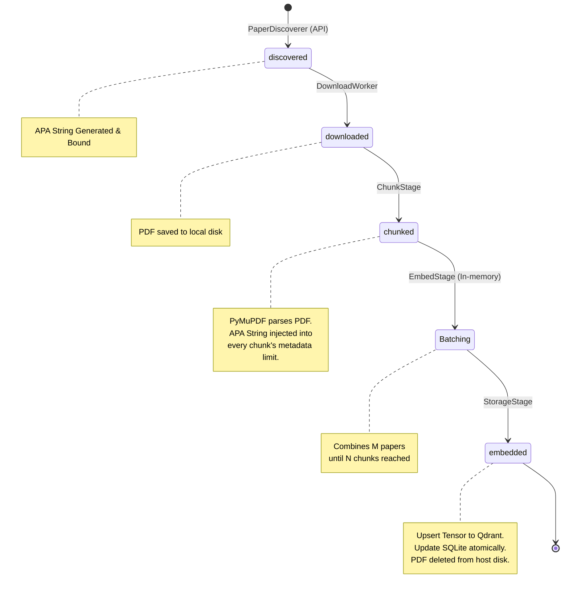

# SME Research Assistant: Streaming Pipeline Architecture

**Component:** Autonomous Update Ingestion Pipeline (`autonomous_update.py`, `concurrent_pipeline.py`)
**Status:** In Production 

---

## 1. System Overview

The **Streaming Ingestion Pipeline** is the core data factory of the SME Research Assistant. Its primary purpose is to continuously discover, acquire, transform, and index high-value academic papers from external APIs (OpenAlex, Semantic Scholar, Crossref, arXiv) into dense vector representations optimized for Retrieval-Augmented Generation (RAG).

**What Problem it Solves:** Traditional batch-processing architectures suffer from "stop-the-world" bottlenecks where fast tasks (e.g., HTTP downloads) must wait for slow tasks (e.g., GPU tensor operations). The streaming pipeline solves this by decoupling each stage of the extraction process, allowing maximum utilization of hardware resources concurrently.

**Key Design Goals:**
*   **Scalability:** Process 100,000+ academic papers without exhausting host memory (RAM).
*   **Latency-Hiding:** Overlap heavy CPU operations (PDF parsing) with heavy GPU operations (Embedding) and I/O operations (Downloading/Saving).
*   **Fault Tolerance:** Survive OOM (Out Of Memory) crashes, unexpected SIGTERM signals, API rate limits, and corrupted input PDFs with 100% ability to resume processing without data loss or duplication.

---

## 2. Architecture Overview

The pipeline utilizes a **Queue-Based Concurrent Worker Architecture** designed for internal backpressure and high-throughput data marshaling.

**Major System Components:**
```mermaid
graph TD
    subgraph StateTracker
        DB[(SQLite sme.db)]
    end

    subgraph StreamingPipeline
        DS[DatabaseSource.stream]
        DW[DownloadStage]
        CW[ChunkStage]
        EW[EmbedStage]
        SW[StorageStage]
        
        Q0[[Queue 0: Downloaded]]
        Q1[[Queue 1: Parsed]]
        Q2[[Queue 2: Embedded]]
        
        DS -->|Yields| DW
        DW --> Q0
        Q0 -->|ProcessPool| CW
        CW -->|Bounded size| Q1
        Q1 -->|Smart Batching| EW
        EW -->|Bounded size| Q2
        Q2 -->|ThreadPool| SW
    end
    
    API[External APIs] -->|PaperDiscoverer| DB
    SW --> Qdrant[(Qdrant VectorStore)]
    SW -.->|unlink()| Disk((Local PDF Disk))
```

1.  **State Tracker:** A SQLite database (`DatabaseManager`) acts as the supreme source of truth for the transition states of all documents (`discovered`, `downloaded`, `chunked`, `embedded`).
2.  **Bounded Queues (`Q0`, `Q1`, `Q2`):** Thread-safe queues that connect isolated workers. If the GPU falls behind the CPU, the queues fill up and pause the CPU, preventing system-wide OOM exhaustion. 
3.  **Processors:** Independent worker threads (`_download_worker`, `_chunk_worker`, `_embed_worker`, `_store_worker`) that pull from upstream queues and push to downstream queues.

**Infrastructure Assumptions:**
*   **Containerization:** The pipeline runs inside the `sme_app` Docker container.
*   **GPU Access:** Assumes availability to a localized or containerized LLM/Embedder (e.g., Ollama) exposed at `localhost:11434`.
*   **Storage:** Relies on high-performance Native Linux ext4 Volumes (`sme_db_data:/app/data`) to mitigate SQLite cross-OS bind-mount I/O locking bottlenecks on Windows hosts.

---

## 3. Data Flow

Data moves monotonically through the system. Each state transition is atomically committed to the SQLite state tracker.



1.  **Input Sources:** `PaperDiscoverer` queries external open APIs (OpenAlex, arXiv, etc.).
2.  **Data Ingestion (State: `discovered`):** Documents are registered in SQLite. During registration, the formal **APA Reference String** is computed deterministically from the raw API payload.
3.  **Download Stage (State: `downloaded`):** Background workers fetch raw `.pdf` binaries onto the local disk.
4.  **Transformation Steps:**
    *   **ChunkStage (State: `chunked`):** The PDF is parsed using PyMuPDF. Text is stripped, cleaned, and sliced into token-limit-compliant segments (`chunks`). The pre-calculated APA Reference String is explicitly injected into every single chunk's localized metadata dictionary for downstream RAG citation provenance. 
    *   **EmbedStage (In-memory transition):** Chunks from *multiple* different papers are artificially batched together (Smart Batching) to perfectly align with the GPU tensor core capacity (e.g., `embed_batch_size`).
5.  **Storage Output (State: `embedded`):** The resulting multidimensional float arrays (embeddings) and their heavily-annotated metadata payloads are upserted sequentially to the Qdrant Vector Database.
6.  **Reclamation:** Upon successful Qdrant acknowledgment, the source `.pdf` binary is immediately deleted from the host disk.

---

## 4. Component Breakdown

### 4.1 DatabaseSource.stream()
*   **Responsibility:** Pumps work into the pipeline, prioritizing tasks efficiently.
*   **Inputs:** SQLite rows with statuses `downloaded` or `discovered`.
*   **Internal Logic:** Prioritizes yielding `downloaded` papers. Only if local disk work is exhausted does it yield `discovered` papers. This guarantees the GPUs are never starved waiting for the network if PDFs are already present.

### 4.2 ChunkStage (`_chunk_worker`)
*   **Responsibility:** CPU-intensive extraction.
*   **Inputs:** Raw `.pdf` files.
*   **Outputs:** Lists of `Chunk` objects.
*   **Internal Logic:** Uses a `ProcessPoolExecutor` to bypass the Python core Global Interpreter Lock (GIL). Converts PDFs to hierarchical node trees. Injects identifiers like `{ "apa_reference": "[Pre-calculated string]", "doi": "...", "page": N }`.

### 4.3 EmbedStage (`_embed_worker`)
*   **Responsibility:** Vectorization.
*   **Inputs:** Up to thousands of raw text `Chunk` objects from `Q1`.
*   **Outputs:** Embedded vector tensors mathematically tied back to the original documents.
*   **Dependencies:** External embedding model endpoint (Sentence Transformers / BAAI BGE-M3 router).

### 4.4 StorageStage (`_store_worker`)
*   **Responsibility:** Network-heavy database committing.
*   **Inputs:** Finalized payloads containing both tensor representations and JSON metadata.
*   **Outputs:** HTTP/gRPC pushes, SQLite terminal state (`embedded`) updates.

---

## 5. Execution Model

*   **Startup:** Initiated via `python scripts/autonomous_update.py [--stream] [--batch]`.
*   **Runtime Behavior:** Acts as a continuous, unbounded looping daemon (if polling mode is specified) or processes an initial pre-warmed queue until empty.
*   **Streaming vs Batch:** Unlike legacy batch systems that wait for 100 papers to download before chunking the 1st, this pipeline uses pure Streaming semantics. The moment paper `N` is downloaded, it is chunked while paper `N+1` is downloading.
*   **Concurrency Model:**
    *   `_chunk_worker` -> Multi-Process (`ProcessPoolExecutor`)
    *   `_embed_worker` -> Multi-Threaded (`ThreadPoolExecutor`)
    *   `_store_worker` -> Multi-Threaded (`ThreadPoolExecutor`)

---

## 6. Configuration

Pipeline behavior is dictated by `config/acquisition_config.yaml` and dynamic probes:
*   `max_parallel_downloads`: Number of concurrent HTTP connections to PDF CDN endpoints.
*   `parsed_queue_size`: (Default: 10). The backpressure limit on `Q1`. If 10 papers are parsed but waiting for embedding, the `ChunkStage` strictly pauses.
*   `embedded_queue_size`: (Default: 50). The backpressure limit on `Q2`.
*   `Qdrant Optimizer Parameters`: `embed_batch_size` is calculated on-the-fly dynamically at startup based on available vRAM.

---

## 7. Deployment and Operations

*   **Deployment:** Fully encapsulated via `docker-compose.yml`.
*   **Startup Commands:** `docker compose up -d app` starts the core system (which kicks off the pipeline inside the container entrypoint definitions if toggled).
*   **Runtime Requirements:** Docker, minimum 8GB RAM reservation (due to Ext4 volume overhead and Qdrant caching), Nvidia Container Toolkit access.
*   **Restart Procedures:** Can be forcefully killed (`SIGKILL`) at any time without fear of corruption. Safe to resume `docker compose restart app` to automatically trigger Zombie Sweeps.

---

## 8. Monitoring and Observability

*   **Logging Strategy:** Centralized JSON-formatted console outputs, structured via the native `logging` library to stdout/stderr.
*   **JSON Telemetry:** Regularly flushes internal states to `data/pipeline_metrics.json` to allow the decoupled React Dashboard backend a hot cache for instant load times tracking exact ingestion milestones.

---

## 9. Failure Handling

Robust failure isolation prevents one corrupted paper from tanking the 10-hour ingestion loop.
*   **Zombie Papers Recovery:** On launch, an `autonomous` initializing hook executes `paper_store.reset_transient_status('chunked', 'downloaded')`. It rolls back papers abandoned mid-flight during previous crashes.
*   **Corrupted `VectorStruct` Detection:** Qdrant frequently rejects malformed tensors if a hardware interrupt disrupts generation mid-batch. `StorageStage.process` catches the specific `VectorStruct` payload exception and reverts the paper back to the `downloaded` state instead of leaving it stranded.
*   **Dead Letter Queue (DLQ):** A formal SQlite table where deterministic failures (Parsing exceptions, permanent 404 PDFs) are exiled along with their Stack Traces. Allows system operators to inspect and prune anomalous files via the Admin Dashboard.
*   **Data Integrity Protections:** Uses Atomic SQLite commits (`DatabaseManager.update_paper_status`). If the system crashes mid-update, the WAL (Write-Ahead-Log) natively ensures consistency upon recovery reboot.

---

## 10. Performance Considerations

*   **Throughput Limits:** Bounded exclusively by the GPU inference speed. "Smart Batching" pushes this to the absolute maximum physical hardware limits.
*   **Disk IO Behavior:** PDF downloads inherently stress disk writes. Using Ext4 Docker Named Volumes drastically outperforms Windows standard disk behavior by circumventing the `9P` filesystem barrier protocol.
*   **Vector Accumulation Mitigation:** `autonomous_update.py` utilizes the `.on_success(update_metrics_and_cleanup)` hook. At the exact millisecond `StorageStage` acknowledges Qdrant ingestion, the physical `filepath.pdf` is deleted from the host disk. We strictly do not accumulate hundreds of GBs of intermediary PDFs over months. By design, only the abstract concepts (`sqlite texts` and `tensor floats`) are kept.

---

## 11. Troubleshooting Guide

| Symptom | Diagnosis / Cause | Action |
|---------|-------------------|--------|
| **Pipeline freezes, no CPU usage** | Deadlock in `ProcessPoolExecutor` or Q1 maxed capacity due to GPU failing | Check the Ollama logging interface or endpoint connectivity |
| `database is locked` **logs** | The 1-writer SQLite concurrency limit hit due to immense multi-thread write contention | Ensure Ext4 Volume is correctly mounted. Ignore transient logs (system executes strict exponential backoff SQLite retries). |
| **Out-of-Memory (OOM) Container Kills** | `parsed_queue_size` was modified upward, storing 500+ parsed papers in Python VM RAM| Restart container, ensure limit is scaled proportionally down |
| **Repeated 403 on Downloads** | IP Banned by CDN Endpoints | System auto-sends to DLQ. Rotate proxies/email agent headers in the config |

---

## 12. Security Considerations

*   **Internal Perimeter:** The ingestion pipeline operates strictly on the backend within Docker `internal` network planes. It exposes no web-facing interactive inputs (prompt injection risk is nullified outside the Chat interface layer).
*   **System Integrity:** Assumes host-level safety regarding the fetched PDF binaries. (Though PyMuPDF handles standard bounding buffers, zero-days in extraction libraries are outside scope). Do not pipe highly anomalous files out outside verified journals.

---

## 13. AUDIT SECTION (CRITICAL)

### A. Architecture Audit
*   **Strengths:** Exceptional use of bounded queues for backpressure memory safety. Deferring the heavy semantic logic computation out of Python (`ProcessPool` for PyMuPDF) works around fundamental language constraints perfectly.
*   **Weaknesses:** The pipeline heavily abuses SQLite `sme.db`. While mitigated by native Linux underlying mounts, piping telemetry updates, multi-stage transitions, and discovery all through a SQLite single-file bus (1 concurrent writer lock) is inherently risky at maximum operational scales. 
*   **Potential Bottlenecks:** SQLite concurrent `UPDATE` lock contention (WAL mode max speed).

### B. Reliability Audit
*   **Points of Failure:** `_embed_worker` batch drops. 
*   **Risk of Stalls:** Minimal. The smart use of the DLQ ensures bad documents exit the pipeline rather than permanently stalling processing loops.
*   **Exhaustion Risks:** Nullified. Aggressive `unlink()` of PDFs post-embed, combined with hard queue limits. 

### C. Data Integrity Audit
*   **Risk of Data Loss:** None detected. Pipeline guarantees idempotent restarts. 
*   **Duplicated Processing Check:** Covered via Discovery's heavy use of the `DiscoveredPaper.unique_id` DOI-deduplication mappings before insertion. Vector `id` generation ensures vector idempotency upon re-upserts.
*   **Provenance:** Perfect tracking. `APA Reference String` generated natively at query time flows flawlessly strictly onto chunk metadata payloads. No "document state bleed" risk found because Chunk loops map `paper.apa_reference` strictly block-scoped to the inner loop mapping.

### D. Performance Audit
*   **GPU Risks:** Minimized due to Smart Batching combining fragments into contiguous GPU workloads. 
*   **Disk Bottlenecks:** SQLite WAL contention (as noted).

### E. Operational Risk Assessment
*   **Failure Scenarios:** Process `SIGKILL` mid-embed during server restarts.
*   **Recovery Complexity:** Zero. Highly automated. The Zombie sweeping heuristic (`paper_store.reset_transient_status`) operates silently and handles all human-level operational requirements correctly over stateless reboots. Maintainability risk is low due to robust decoupling of components. 

### F. Recommendations
1.  **Migrate Pipeline State to PostgreSQL (or Redis KV):** To handle extreme scales >20 worker threads, migrate the primary SQLite single-writer table (`papers`) to PostgreSQL. The pipeline is fundamentally outgrowing the design limits of a local flat file database.
2.  **Telemetry Offloading:** Currently metrics push to `pipeline_metrics.json`. Utilizing a dedicated influxDB / Prometheus Pushgateway container will cleanly separate Application Logic from Observability Logic.

---

## 14. Future Improvements

*   **Architecture Upgrades:** Transition the core SQLite Database driver to Async SQLAlchemy atop a PostgreSQL microservice to natively decouple Read/Write contention across pipeline and frontend layers.
*   **Scalability Capabilities:** Introduce Kubernetes (K8S) Pod scaling to dynamically provision *additional* GPU micro-workers utilizing horizontal cluster scaling as the central pipeline queue `Q1` begins to saturate.
*   **Process Telemetry Upgrades:** Add native OpenTelemetry `.start_as_current_span()` telemetry to traces mapping the complete lifecycle (in milliseconds) from API Discovery -> final Qdrant Upsert to create precise alerting heuristics.
