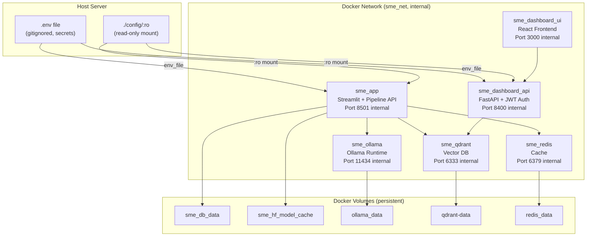
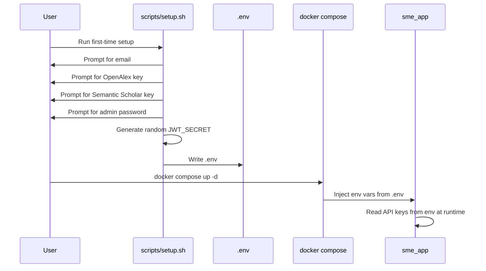

# SME Research Assistant — Production Migration & Credential Architecture Plan

---

## 1. Executive Architecture Overview



**Key Production Principles:**

| Principle | Implementation |
|---|---|
| Immutable containers | Source code baked into images via `COPY`; no `.:/app` bind mount |
| Secrets isolation | All API keys and passwords live in `.env` (gitignored), never in YAML or images |
| Read-only configs | `./config:/config:ro` — containers cannot modify host configs |
| Pinned versions | Every base image uses a specific version tag |
| No public ports | Only `app` (8502) and `dashboard-ui` (3030) are exposed to the host; all infra services are internal-only |
| Per-user credentials | Each installation has its own `.env` with its own API keys, email, and Ollama account |

---

## 2. Secure Credential Management Design

### Current State (INSECURE)

```yaml
# config/acquisition_config.yaml — SECRETS IN PLAINTEXT ❌
emails:
  - "akamel01@mail.ubc.ca"
apis:
  openalex:
    api_key: "jxig8xd8dUs3wujBKJyMn3"
  semantic_scholar:
    api_key: 9cFSf1mS9z1hn2JqZa7298ujHJEN34Uk7HXz0CEu
```

### Target State (SECURE)

```yaml
# config/acquisition_config.yaml — REFERENCES ENV VARS ✅
emails: ${SME_EMAILS}

apis:
  openalex:
    api_key: ${OPENALEX_API_KEY}
  semantic_scholar:
    api_key: ${SEMANTIC_SCHOLAR_API_KEY}
```

```bash
# .env — NEVER COMMITTED TO GIT ✅
OPENALEX_API_KEY=user_provided_key_here
SEMANTIC_SCHOLAR_API_KEY=user_provided_key_here
SME_EMAILS=user@example.com
JWT_SECRET=randomly_generated_64char_hex
```

### Credential Flow



---

## 3. Recommended User Account System

### Architecture Decision: Extend the Existing Dashboard Auth

Your `dashboard/backend/auth.py` already implements:
- ✅ JWT Bearer tokens (15min access, 7d refresh)
- ✅ bcrypt password hashing via `passlib`
- ✅ Role-Based Access Control (admin / operator / viewer)
- ✅ JSON file user store at `/data/dashboard_users.json`

**Recommendation:** Do NOT build a new auth system. Extend the existing one:

| Component | Current | Production |
|---|---|---|
| Dashboard (`:3030`) | JWT auth ✅ | No changes needed |
| Streamlit (`:8502`) | No auth ❌ | Add Streamlit native password auth |
| API Keys | Hardcoded in YAML ❌ | Loaded from `.env` at runtime |
| Admin bootstrapping | Manual ❌ | `scripts/setup.sh` creates first admin |

### Per-User API Key Storage

Since this is a **single-tenant** system (one installation = one user/team on one machine), API keys are stored as environment variables in `.env`, NOT in the user database. This is simpler, more secure, and industry-standard for self-hosted tools.

> [!IMPORTANT]
> Each machine running this system has its own `.env` file with its own credentials. There is no shared credential store between installations.

---

## 4. First-Time Setup Workflow

### `scripts/setup.sh` (Copy-Paste Ready)

```bash
#!/bin/bash
# SME Research Assistant — First-Time Production Setup
# Run this ONCE before 'docker compose up' on a new installation.

set -e

ENV_FILE=".env"
echo "==========================================="
echo "  SME Research Assistant — First-Time Setup"
echo "==========================================="
echo ""

# ── Step 1: Check if already configured ──
if [ -f "$ENV_FILE" ]; then
    echo "⚠️  .env file already exists."
    read -p "Overwrite? (y/N): " OVERWRITE
    if [ "$OVERWRITE" != "y" ] && [ "$OVERWRITE" != "Y" ]; then
        echo "Setup cancelled."
        exit 0
    fi
fi

# ── Step 2: Generate JWT Secret ──
JWT_SECRET=$(openssl rand -hex 32)
echo "✅ Generated JWT_SECRET"

# ── Step 3: Collect User Credentials ──
echo ""
echo "── API Credentials ──"
read -p "Your email address: " USER_EMAIL
read -p "OpenAlex API key (get one at https://openalex.org/): " OPENALEX_KEY
read -p "Semantic Scholar API key (get one at https://www.semanticscholar.org/product/api): " S2_KEY

echo ""
echo "── Dashboard Admin Account ──"
read -p "Admin username: " ADMIN_USER
read -sp "Admin password: " ADMIN_PASS
echo ""
read -sp "Confirm password: " ADMIN_PASS_CONFIRM
echo ""

if [ "$ADMIN_PASS" != "$ADMIN_PASS_CONFIRM" ]; then
    echo "❌ Passwords do not match. Aborting."
    exit 1
fi

if [ ${#ADMIN_PASS} -lt 12 ]; then
    echo "❌ Password must be at least 12 characters. Aborting."
    exit 1
fi

# ── Step 4: Streamlit Password ──
echo ""
echo "── Streamlit UI Password ──"
echo "(This protects http://localhost:8502)"
read -sp "Streamlit UI password: " STREAMLIT_PASS
echo ""

# ── Step 5: Write .env ──
cat > "$ENV_FILE" << EOF
# SME Research Assistant — Environment Configuration
# Generated by setup.sh on $(date -u +"%Y-%m-%dT%H:%M:%SZ")
# ⚠️  DO NOT COMMIT THIS FILE TO GIT

# ── Authentication ──
JWT_SECRET=${JWT_SECRET}
ADMIN_USERNAME=${ADMIN_USER}
ADMIN_PASSWORD=${ADMIN_PASS}
STREAMLIT_PASSWORD=${STREAMLIT_PASS}

# ── API Keys ──
OPENALEX_API_KEY=${OPENALEX_KEY}
SEMANTIC_SCHOLAR_API_KEY=${S2_KEY}
SME_EMAILS=${USER_EMAIL}

# ── Ollama ──
# After setup, link your Ollama account:
#   docker exec -it sme_ollama ollama signin
EOF

chmod 600 "$ENV_FILE"
echo ""
echo "✅ .env file written (permissions: 600)"

# ── Step 6: Build and Create Admin User ──
echo ""
echo "Building containers..."
docker compose build

echo ""
echo "Creating admin user..."
docker compose run --rm dashboard-backend python -c "
from auth import create_user
create_user('${ADMIN_USER}', '${ADMIN_PASS}', 'admin')
print('✅ Admin user created')
"

echo ""
echo "==========================================="
echo "  ✅ Setup Complete!"
echo "==========================================="
echo ""
echo "Next steps:"
echo "  1. Start the system:  docker compose up -d"
echo "  2. Link Ollama:       docker exec -it sme_ollama ollama signin"
echo "  3. Open Dashboard:    http://localhost:3030"
echo "  4. Open Streamlit:    http://localhost:8502"
echo ""
```

---

## 5. Onboarding UX Design

### User Journey

```
┌─────────────────────────────────────────────────────────┐
│                INSTALLATION GUIDE                       │
├─────────────────────────────────────────────────────────┤
│                                                         │
│  Step 1: Clone the repository                           │
│  ────────────────────────────                           │
│  $ git clone https://github.com/org/sme-research.git    │
│  $ cd sme-research                                      │
│                                                         │
│  Step 2: Run first-time setup                           │
│  ────────────────────────────                           │
│  $ bash scripts/setup.sh                                │
│                                                         │
│    → Enter your email                                   │
│    → Enter your OpenAlex API key                        │
│    → Enter your Semantic Scholar API key                │
│    → Create admin username/password                     │
│    → Set Streamlit UI password                          │
│                                                         │
│  Step 3: Start the system                               │
│  ────────────────────────────                           │
│  $ docker compose up -d                                 │
│                                                         │
│  Step 4: Link your Ollama account                       │
│  ────────────────────────────                           │
│  $ docker exec -it sme_ollama ollama signin             │
│                                                         │
│    → Opens a browser to sign in to YOUR Ollama account  │
│    → Device key is saved inside the ollama_data volume  │
│                                                         │
│  Step 5: Verify everything works                        │
│  ────────────────────────────                           │
│  $ bash scripts/validate.sh                             │
│                                                         │
│  Step 6: Access the system                              │
│  ────────────────────────────                           │
│    Dashboard: http://localhost:3030                      │
│    Streamlit: http://localhost:8502                      │
│                                                         │
└─────────────────────────────────────────────────────────┘
```

---

## 6. Changes to `acquisition_config.yaml`

### Diff

```diff
  # Multiple emails for load balancing and fallback
  emails:
-    - "akamel01@mail.ubc.ca"
-    - "ahmed.kamel@ubc.ca"
-    - "ahmedbayoumi@cu.edu.eg"
-    - "taahmedbayoumi@gmail.com"
+    - "${SME_EMAILS}"
 
   apis:
     openalex:
       enabled: true
-      api_key: "jxig8xd8dUs3wujBKJyMn3"
+      api_key: "${OPENALEX_API_KEY}"
 
     semantic_scholar:
       enabled: true
-      api_key: 9cFSf1mS9z1hn2JqZa7298ujHJEN34Uk7HXz0CEu
+      api_key: "${SEMANTIC_SCHOLAR_API_KEY}"
```

### Runtime Resolution

The Python code that reads this config must resolve `${VAR}` references from environment variables. Add a helper:

```python
# src/utils/env_resolver.py
import os
import re

def resolve_env_vars(value):
    """Replace ${VAR_NAME} with os.environ['VAR_NAME']."""
    if isinstance(value, str):
        def replacer(match):
            var_name = match.group(1)
            env_val = os.environ.get(var_name)
            if env_val is None:
                raise EnvironmentError(
                    f"Required environment variable '{var_name}' is not set. "
                    f"Run scripts/setup.sh to configure."
                )
            return env_val
        return re.sub(r'\$\{(\w+)\}', replacer, value)
    elif isinstance(value, dict):
        return {k: resolve_env_vars(v) for k, v in value.items()}
    elif isinstance(value, list):
        return [resolve_env_vars(item) for item in value]
    return value
```

Integrate into config loading:

```diff
# src/utils/helpers.py — load_config()
 def load_config(path):
     with open(path) as f:
         config = yaml.safe_load(f)
+    from src.utils.env_resolver import resolve_env_vars
+    config = resolve_env_vars(config)
     return config
```

---

## 7. Secrets Management Strategy

| Secret | Storage | Access Method |
|---|---|---|
| OpenAlex API Key | `.env` | `os.environ["OPENALEX_API_KEY"]` via env_resolver |
| Semantic Scholar API Key | `.env` | `os.environ["SEMANTIC_SCHOLAR_API_KEY"]` via env_resolver |
| User email(s) | `.env` | `os.environ["SME_EMAILS"]` via env_resolver |
| JWT Secret | `.env` | `os.environ["JWT_SECRET"]` (already implemented) |
| Admin password | `.env` | Used only during `setup.sh` bootstrap; stored bcrypt-hashed in user DB |
| Streamlit password | `.env` | `os.environ["STREAMLIT_PASSWORD"]` |
| Ollama device key | `ollama_data` volume | Stored automatically by `ollama signin` |

### `.gitignore` Additions

```gitignore
# Secrets — NEVER commit
.env
.env.*
!.env.example
```

### `.env.example` (Committed to Git as Template)

```bash
# SME Research Assistant — Environment Template
# Copy to .env and fill in your values:  cp .env.example .env

# ── Authentication ──
JWT_SECRET=          # auto-generated by setup.sh (64 hex chars)
ADMIN_USERNAME=      # your dashboard admin username
ADMIN_PASSWORD=      # your dashboard admin password (min 12 chars)
STREAMLIT_PASSWORD=  # password for Streamlit UI access

# ── API Keys ──
OPENALEX_API_KEY=    # https://openalex.org/
SEMANTIC_SCHOLAR_API_KEY=  # https://www.semanticscholar.org/product/api
SME_EMAILS=          # your email address for API identification

# ── Ollama ──
# Link your account after first start:
#   docker exec -it sme_ollama ollama signin
```

---

## 8. Docker Production Architecture

### Production `docker-compose.yml` (Complete File)

```yaml
x-logging: &default-logging
  driver: "json-file"
  options:
    max-size: "50m"
    max-file: "3"

services:
  redis:
    image: redis:7.4-alpine
    container_name: sme_redis
    logging: *default-logging
    # No ports exposed — internal only
    volumes:
      - redis_data:/data
    command: redis-server --appendonly yes
    healthcheck:
      test: [ "CMD", "redis-cli", "ping" ]
      interval: 10s
      timeout: 5s
      retries: 5
    restart: unless-stopped

  qdrant:
    image: qdrant/qdrant:v1.12.6
    container_name: sme_qdrant
    logging: *default-logging
    # No ports exposed — internal only
    volumes:
      - qdrant-data:/qdrant/storage
    environment:
      - QDRANT__STORAGE__ON_DISK_PAYLOAD=true
      - QDRANT__SERVICE__GRPC_PORT=6334
      - QDRANT__STORAGE__WAL__WAL_CAPACITY_MB=2048
      - QDRANT__STORAGE__WAL__WAL_SEGMENTS_AHEAD=2
    deploy:
      resources:
        limits:
          memory: 48G
        reservations:
          memory: 8G
    stop_grace_period: 30s
    healthcheck:
      test: [ "CMD-SHELL", "bash -c '(echo > /dev/tcp/localhost/6333) >/dev/null 2>&1'" ]
      interval: 10s
      timeout: 5s
      retries: 5
    restart: unless-stopped

  ollama:
    image: ollama/ollama:0.6.2
    container_name: sme_ollama
    hostname: sme_ollama_docker
    logging: *default-logging
    # No ports exposed — internal only
    volumes:
      - ollama_data:/root/.ollama
    environment:
      - OLLAMA_GPU_OVERHEAD=0
      - OLLAMA_KEEP_ALIVE=10m
      - OLLAMA_NUM_PARALLEL=128
      - OLLAMA_MAX_QUEUE=128
      - OLLAMA_CONTEXT_LENGTH=4096
    deploy:
      resources:
        reservations:
          devices:
            - driver: nvidia
              count: 1
              capabilities: [ gpu ]
    healthcheck:
      test: [ "CMD-SHELL", "bash -c '(echo > /dev/tcp/localhost/11434) >/dev/null 2>&1'" ]
      interval: 30s
      timeout: 10s
      retries: 3
    restart: unless-stopped

  app:
    build: .
    container_name: sme_app
    logging: *default-logging
    ports:
      - "8502:8501"
    volumes:
      # NO source code bind mount — code is baked into image
      - sme_db_data:/app/data
      - sme_hf_model_cache:/root/.cache/huggingface
      - ./config:/app/config:ro   # Read-only config
    env_file:
      - .env
    environment:
      - PYTHONUNBUFFERED=1
      - NVIDIA_VISIBLE_DEVICES=all
      - NVIDIA_DRIVER_CAPABILITIES=all
    deploy:
      resources:
        reservations:
          devices:
            - driver: nvidia
              count: 1
              capabilities: [ gpu ]
    depends_on:
      - qdrant
      - redis
      - ollama
    restart: unless-stopped

  dashboard-backend:
    build: ./dashboard/backend
    container_name: sme_dashboard_api
    logging: *default-logging
    # No host ports — accessed only by dashboard-ui via Docker network
    volumes:
      - ./config:/config:ro        # Read-only config
      - sme_db_data:/data:rw
    env_file:
      - .env
    environment:
      - QDRANT_URL=http://sme_qdrant:6333
      - CONFIG_PATH=/config/acquisition_config.yaml
      - DB_PATH=/data/sme.db
      - CORS_ORIGINS=http://localhost:3030,http://localhost:3000
    deploy:
      resources:
        limits:
          cpus: "2"
          memory: 2g
    depends_on:
      - qdrant
      - app
    restart: unless-stopped

  dashboard-ui:
    build: ./dashboard/frontend
    container_name: sme_dashboard_ui
    logging: *default-logging
    ports:
      - "3030:3000"
    deploy:
      resources:
        limits:
          cpus: "1"
          memory: 512m
    depends_on:
      - dashboard-backend
    restart: unless-stopped

  gpu-exporter:
    build: ./dashboard/gpu_exporter
    container_name: sme_gpu_exporter
    logging: *default-logging
    deploy:
      resources:
        reservations:
          devices:
            - driver: nvidia
              count: 1
              capabilities: [ gpu, utility ]
    restart: unless-stopped

volumes:
  redis_data:
  ollama_data:
  qdrant-data:
  sme_db_data:
  sme_hf_model_cache:
```

---

## 9. `docker-compose.yml` Patch Diff

```diff
--- a/docker-compose.yml
+++ b/docker-compose.yml
@@ -8,9 +8,8 @@
   redis:
-    image: redis:7-alpine
+    image: redis:7.4-alpine
     container_name: sme_redis
     logging: *default-logging
-    ports:
-      - "6380:6379"
+    # No ports exposed — internal only
     volumes:
       - redis_data:/data
@@ -24,11 +23,9 @@
   qdrant:
-    image: qdrant/qdrant:latest
+    image: qdrant/qdrant:v1.12.6
     container_name: sme_qdrant
     logging: *default-logging
-    ports:
-      - "6334:6333"
-      - "6335:6334"
+    # No ports exposed — internal only
     volumes:
       - qdrant-data:/qdrant/storage
@@ -52,11 +49,9 @@
   ollama:
-    image: ollama/ollama:latest
+    image: ollama/ollama:0.6.2
     container_name: sme_ollama
     hostname: sme_ollama_docker
     logging: *default-logging
-    ports:
-      - "11435:11434"
+    # No ports exposed — internal only
     volumes:
       - ollama_data:/root/.ollama
@@ -85,13 +80,15 @@
     ports:
       - "8502:8501"
     volumes:
-      - .:/app
+      # NO source code bind mount — code is baked into image
       - sme_db_data:/app/data
       - sme_hf_model_cache:/root/.cache/huggingface
-      - ./config/docker_config.yaml:/app/config/config.yaml
+      - ./config:/app/config:ro
+    env_file:
+      - .env
     environment:
       - PYTHONUNBUFFERED=1
-      - NVIDIA_VISIBLE_DEVICES=all
-      - NVIDIA_DRIVER_CAPABILITIES=all
+      - NVIDIA_VISIBLE_DEVICES=all
+      - NVIDIA_DRIVER_CAPABILITIES=all

@@ -111,11 +108,12 @@
   dashboard-backend:
     build: ./dashboard/backend
     container_name: sme_dashboard_api
     logging: *default-logging
-    ports:
-      - "8400:8400"
+    # No host ports — internal only
     volumes:
-      - ./config:/config:rw
+      - ./config:/config:ro
       - sme_db_data:/data:rw
+    env_file:
+      - .env
     environment:
-      - JWT_SECRET=${JWT_SECRET:-changeme_dev_only}
       - QDRANT_URL=http://sme_qdrant:6333
```

---

## 10. Dockerfile Improvements

### Main `Dockerfile` — No Changes Required

The existing Dockerfile already uses:
```dockerfile
COPY src ./src
COPY app ./app
COPY config ./config
COPY scripts ./scripts
```

The bind mount `.:/app` in docker-compose was **overlaying** these copies during development. By removing the bind mount, the baked-in copies become active. ✅ No Dockerfile changes needed.

### Dashboard Backend `Dockerfile` — No Changes Required

Already runs as non-root user, already copies source via `COPY . .`. ✅

---

## 11. `.dockerignore` Template

Create this file at the project root:

```dockerignore
# Git
.git
.gitignore

# Environment / Secrets
.env
.env.*

# Python artifacts
__pycache__
*.pyc
*.pyo
*.egg-info
.pytest_cache
.mypy_cache
.venv
venv

# IDE
.vscode
.idea
*.swp
*.swo

# Data directories (use Docker volumes)
data/
DataBase/
logs/
logs_dump.txt
full_logs.txt
docker_temp.log
error_inspection.log

# Backups
backup/

# Documentation (not needed at runtime)
documentation/
*.md
!README.md

# Tools and tests
tools/
tests/
test_*.py

# OS
Thumbs.db
.DS_Store

# Gemini / AI tooling
.gemini/
.antigravityignore
```

---

## 12. Environment Variable Strategy

### Variable Taxonomy

| Variable | Source | Injected Via | Used By |
|---|---|---|---|
| `JWT_SECRET` | `setup.sh` (auto-generated) | `env_file: .env` | dashboard-backend |
| `ADMIN_USERNAME` | User input | `.env` | `setup.sh` only |
| `ADMIN_PASSWORD` | User input | `.env` | `setup.sh` only |
| `STREAMLIT_PASSWORD` | User input | `env_file: .env` | app (Streamlit) |
| `OPENALEX_API_KEY` | User input | `env_file: .env` | app (acquisition pipeline) |
| `SEMANTIC_SCHOLAR_API_KEY` | User input | `env_file: .env` | app (acquisition pipeline) |
| `SME_EMAILS` | User input | `env_file: .env` | app (acquisition pipeline) |
| `QDRANT_URL` | Hardcoded | `environment:` | dashboard-backend |
| `CONFIG_PATH` | Hardcoded | `environment:` | dashboard-backend |
| `NVIDIA_VISIBLE_DEVICES` | Hardcoded | `environment:` | app |

---

## 13. Database Schema for User Credentials

### Existing Schema (No Changes Needed)

The dashboard backend stores users in `/data/dashboard_users.json` (inside the `sme_db_data` volume):

```json
{
  "admin": {
    "username": "admin",
    "role": "admin",
    "hashed_password": "$2b$12$..."
  }
}
```

> [!NOTE]
> Passwords are bcrypt-hashed. The plaintext password in `.env` is used ONLY during the initial `setup.sh` bootstrap. After that, only the hash persists.

---

## 14. Secure API Key Storage Method

### Method: Environment Variables via `.env` File

| Property | Implementation |
|---|---|
| At rest | `.env` file, `chmod 600`, owned by deploying user |
| In transit | Docker injects via process environment; never traverses network |
| In memory | Available as `os.environ[]`; never logged |
| In config files | Referenced as `${VAR_NAME}`, resolved at runtime |
| In Git | `.env` is gitignored; `.env.example` is committed as template |
| In images | Never baked into Docker images |

### Anti-Leak Safeguards

Add to `src/utils/helpers.py`:

```python
# Prevent accidental logging of secrets
import logging
REDACTED_KEYS = {"OPENALEX_API_KEY", "SEMANTIC_SCHOLAR_API_KEY", "JWT_SECRET"}

class SecretFilter(logging.Filter):
    def filter(self, record):
        msg = record.getMessage()
        for key in REDACTED_KEYS:
            val = os.environ.get(key, "")
            if val and val in msg:
                record.msg = msg.replace(val, "***REDACTED***")
        return True
```

---

## 15. Ollama Account Linking Flow

### How It Works

Ollama uses **device keys** to link a local machine to an Ollama cloud account. These keys are stored in `~/.ollama/` which maps to the `ollama_data` Docker volume.

### Per-User Linking Procedure

```bash
# Step 1: Start the system
docker compose up -d

# Step 2: Sign into YOUR Ollama account
docker exec -it sme_ollama ollama signin

# This opens a browser URL. Sign in with YOUR Ollama account.
# The device key is saved into the ollama_data volume.

# Step 3: Verify
docker exec sme_ollama ollama list
# Should show your accessible models
```

> [!CAUTION]
> **Never distribute your `ollama_data` volume to other users.** It contains your device key. Each user must run `ollama signin` independently.

### Validation Script

```bash
# scripts/validate_ollama.sh
#!/bin/bash
echo "Checking Ollama connectivity..."
docker exec sme_ollama ollama list >/dev/null 2>&1
if [ $? -eq 0 ]; then
    echo "✅ Ollama is connected and authenticated"
else
    echo "❌ Ollama not authenticated. Run: docker exec -it sme_ollama ollama signin"
    exit 1
fi
```

---

## 16. CLI Instructions for Users

### Quick Reference Card

```
╔══════════════════════════════════════════════════════════╗
║        SME Research Assistant — Command Reference       ║
╠══════════════════════════════════════════════════════════╣
║                                                          ║
║  FIRST-TIME SETUP                                        ║
║  ─────────────────                                       ║
║  bash scripts/setup.sh                                   ║
║                                                          ║
║  START / STOP                                            ║
║  ─────────────────                                       ║
║  docker compose up -d          # Start all services      ║
║  docker compose down           # Stop all services       ║
║  docker compose restart app    # Restart app only        ║
║                                                          ║
║  OLLAMA ACCOUNT                                          ║
║  ─────────────────                                       ║
║  docker exec -it sme_ollama ollama signin                ║
║                                                          ║
║  UPDATE CREDENTIALS                                      ║
║  ─────────────────                                       ║
║  1. Edit .env file                                       ║
║  2. docker compose down && docker compose up -d          ║
║                                                          ║
║  REBUILD AFTER CODE UPDATE                               ║
║  ─────────────────                                       ║
║  docker compose build --no-cache                         ║
║  docker compose up -d                                    ║
║                                                          ║
║  VIEW LOGS                                               ║
║  ─────────────────                                       ║
║  docker compose logs -f app    # App logs                ║
║  docker compose logs -f --tail=100  # All last 100       ║
║                                                          ║
║  VALIDATE INSTALLATION                                   ║
║  ─────────────────                                       ║
║  bash scripts/validate.sh                                ║
║                                                          ║
║  ACCESS POINTS                                           ║
║  ─────────────────                                       ║
║  Dashboard:  http://localhost:3030                        ║
║  Streamlit:  http://localhost:8502                        ║
║                                                          ║
╚══════════════════════════════════════════════════════════╝
```

---

## 17. CI/CD Pipeline Example

### GitHub Actions: `.github/workflows/build.yml`

```yaml
name: Build & Push Production Images

on:
  push:
    tags: ['v*']

env:
  REGISTRY: ghcr.io
  IMAGE_PREFIX: ${{ github.repository }}

jobs:
  build:
    runs-on: ubuntu-latest
    strategy:
      matrix:
        service:
          - { name: app, context: ".", file: Dockerfile }
          - { name: dashboard-backend, context: dashboard/backend, file: dashboard/backend/Dockerfile }
          - { name: dashboard-ui, context: dashboard/frontend, file: dashboard/frontend/Dockerfile }

    steps:
      - uses: actions/checkout@v4

      - name: Log in to GHCR
        uses: docker/login-action@v3
        with:
          registry: ${{ env.REGISTRY }}
          username: ${{ github.actor }}
          password: ${{ secrets.GITHUB_TOKEN }}

      - name: Build and push
        uses: docker/build-push-action@v5
        with:
          context: ${{ matrix.service.context }}
          file: ${{ matrix.service.file }}
          push: true
          tags: |
            ${{ env.REGISTRY }}/${{ env.IMAGE_PREFIX }}/${{ matrix.service.name }}:${{ github.ref_name }}
            ${{ env.REGISTRY }}/${{ env.IMAGE_PREFIX }}/${{ matrix.service.name }}:latest
```

---

## 18. Deployment Runbook

### Pre-Deployment (Day -1)

```bash
# 1. Tag the release
git tag -a v1.0.0 -m "Production release"
git push origin v1.0.0

# 2. Build production images locally (or wait for CI)
docker compose build --no-cache

# 3. Test locally
docker compose up -d
bash scripts/validate.sh
docker compose down
```

### Deployment (Day 0)

```bash
# 1. SSH into production server
ssh deploy@prod-server

# 2. Clone or pull latest
cd /opt/sme-research
git pull origin main

# 3. Run first-time setup (if new server)
bash scripts/setup.sh

# 4. Start services
docker compose up -d

# 5. Link Ollama account
docker exec -it sme_ollama ollama signin

# 6. Validate
bash scripts/validate.sh

# 7. Monitor first 10 minutes of logs
docker compose logs -f --tail=50
```

### Post-Deployment Verification

```bash
# Health checks
curl -f http://localhost:8502/_stcore/health || echo "❌ Streamlit DOWN"
docker exec sme_redis redis-cli ping | grep PONG || echo "❌ Redis DOWN"
docker exec sme_qdrant bash -c '(echo > /dev/tcp/localhost/6333) 2>/dev/null' && echo "✅ Qdrant UP" || echo "❌ Qdrant DOWN"
docker exec sme_ollama ollama list >/dev/null 2>&1 && echo "✅ Ollama UP" || echo "❌ Ollama DOWN"
```

---

## 19. Rollback Plan

```bash
# ── Option 1: Roll back to previous image ──
docker compose down
git checkout v0.9.0  # previous tag
docker compose build
docker compose up -d

# ── Option 2: Emergency stop ──
docker compose down

# ── Data is safe ──
# All persistent data lives in Docker volumes.
# Volumes are NOT deleted by `docker compose down`.
# Only `docker compose down -v` deletes volumes.
```

> [!CAUTION]
> **NEVER** run `docker compose down -v` in production. This deletes all data volumes including Qdrant vectors, Redis cache, the user database, and the reranker model cache.

---

## 20. Security Hardening Checklist

| # | Item | Status |
|---|---|---|
| 1 | No plaintext secrets in YAML files | ☐ |
| 2 | `.env` file has `chmod 600` permissions | ☐ |
| 3 | `.env` is in `.gitignore` | ☐ |
| 4 | `JWT_SECRET` is randomly generated (≥32 bytes) | ☐ |
| 5 | Admin password ≥ 12 characters | ☐ |
| 6 | No `ports:` on Redis, Qdrant, Ollama | ☐ |
| 7 | Config mounts are `:ro` (read-only) | ☐ |
| 8 | No `.:/app` bind mount | ☐ |
| 9 | Dashboard backend runs as non-root (`USER dashboard`) | ☐ |
| 10 | Base images use pinned version tags | ☐ |
| 11 | `.dockerignore` excludes `.env`, `data/`, `.git` | ☐ |
| 12 | Streamlit UI is password-protected | ☐ |
| 13 | Dashboard uses JWT with short-lived tokens (15min) | ☐ |
| 14 | Ollama device key is per-user (not shared) | ☐ |
| 15 | No `CHANGE_ME_IN_PRODUCTION` defaults active | ☐ |

---

## 21. Production Readiness Checklist

Execute these steps line by line before declaring production-ready:

```bash
# ── File System ──
[ -f .env ]                    && echo "✅ .env exists"         || echo "❌ MISSING .env"
[ -f .env.example ]            && echo "✅ .env.example exists" || echo "❌ MISSING .env.example"
[ -f .dockerignore ]           && echo "✅ .dockerignore exists"|| echo "❌ MISSING .dockerignore"
stat -c "%a" .env 2>/dev/null | grep -q "600" && echo "✅ .env permissions 600" || echo "❌ .env permissions not 600"
grep -q ".env" .gitignore      && echo "✅ .env in .gitignore"  || echo "❌ .env NOT in .gitignore"

# ── Secrets ──
grep -rn "jxig8xd8dUs3wujBKJyMn3" config/ && echo "❌ LEAKED: OpenAlex key in config" || echo "✅ No OpenAlex key in config"
grep -rn "9cFSf1mS9z1hn2JqZa7298ujHJEN34Uk7HXz0CEu" config/ && echo "❌ LEAKED: S2 key in config" || echo "✅ No S2 key in config"
grep -rn "akamel01@mail.ubc.ca" config/ && echo "❌ LEAKED: Personal email in config" || echo "✅ No personal email in config"
grep -q "CHANGE_ME" .env       && echo "❌ Placeholder secrets in .env" || echo "✅ No placeholder secrets"

# ── Docker Compose ──
grep -q "\.:/app" docker-compose.yml && echo "❌ Source bind mount present" || echo "✅ No source bind mount"
grep -q ":latest" docker-compose.yml && echo "❌ Unpinned :latest tags"    || echo "✅ All images pinned"
grep -q ":rw" docker-compose.yml     && echo "⚠️  RW mounts found"        || echo "✅ No RW config mounts"
grep -c "ports:" docker-compose.yml | xargs -I{} test {} -le 2 && echo "✅ Max 2 port exposures" || echo "❌ Too many exposed ports"

# ── Container Health ──
docker compose ps --format "{{.Name}} {{.Status}}" | while read name status; do
    echo "$status" | grep -qi "up" && echo "✅ $name is running" || echo "❌ $name is DOWN"
done

# ── Service Connectivity ──
docker exec sme_redis redis-cli ping | grep -q PONG && echo "✅ Redis responding" || echo "❌ Redis not responding"
docker exec sme_app curl -sf http://localhost:8501/_stcore/health >/dev/null && echo "✅ Streamlit healthy" || echo "❌ Streamlit unhealthy"

# ── Authentication ──
curl -sf http://localhost:3030 >/dev/null && echo "✅ Dashboard UI reachable" || echo "❌ Dashboard UI unreachable"

echo ""
echo "════════════════════════════════════════"
echo "  Production Readiness Check Complete"
echo "════════════════════════════════════════"
```
